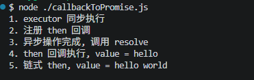

# JavaScript的异步操作

## 简介

Javascript的所有异步操作都是基于一个前提：Javascript是一个单线程语言，通过事件循环才实现的异步非阻塞。所以不管是最早的回调函数，还是Promise，以及现在流行的async/await，所有的异步优化都是在单线程事件循环的机制下进行的。

## JavaScript的发展

JavaScript异步编程主要经历以下几个关键阶段：

> Callback → Promise (ES2015) → Generator + co (ES2015) → async/await (ES2017)

### 回调函数（Callback）-- 最为原始的异步方案

回调函数是最早的异步模式。将一个函数作为参数传入异步操作，异步完成后调用该函数。

我们以一个模拟异步读取文件的例子作为案例来分析一下

```javascript
// 模拟异步读取文件
function readFile(filename, callback) {
  setTimeout(() => {
    console.log(`读取文件: ${filename}`);
    callback(null, ` ${filename}的文件内容`);
  }, 1000);
}

readFile("file1.txt", function (err, data1) {
  if (err) throw err;
  console.log(data1);
  readFile("file2.txt", function (err, data2) {
    if (err) throw err;
    console.log(data2);
    readFile("file3.txt", function (err, data3) {
      if (err) throw err;
      console.log(data3);
      readFile("file4.txt", function (err, data4) {
        if (err) throw err;
        console.log(data4);
        // ... 更多文件读取
      });
    });
  });
});
```

| 问题                             | 描述                                                                                      |
| -------------------------------- | ----------------------------------------------------------------------------------------- |
| 回调地狱（Callback Hell）        | 多层嵌套导致代码横向扩展，可读性极差                                                      |
| 信任问题（Inversion of Control） | 回调的执行权交给第三方，无法保证回调是否被正确调用（调用过多、过少、不调用、 吞掉错误等） |
| 错误处理困难                     | 每一层都需要手动检查err，且无法使用try/catch捕获异步错误                                  |

> 关于信任问题的详细解释说明，可以看这篇文章：
> [关于回调函数存在的信任问题详解](./关于回调函数存在的信任问题详解.md)

### Promise -- 解决回调地狱和信任问题

> Promise 最早由社区提出（CommonJS Promises/A 规范），后由 Promises/A+ 规范统一，最终在 ES2015 (ES6) 被纳入语言标准。

那么上面的回调代码用Promise可以写成：

```javascript
function ReadFile(filename) {
  return new Promise(function (resolve, reject) {
    setTimeout(function () {
      console.log(`读取文件: ${filename}`);
      resolve(`${filename}的文件内容`);
    }, 1000);
  });
}

ReadFile("file1.txt")
  .then(function (data) {
    console.log(data);
    return ReadFile("file2.txt");
  })
  .then(function (data) {
    console.log(data);
    return ReadFile("file3.txt");
  })
  .then(function (data) {
    console.log(data);
    return ReadFile("file4.txt");
  })
  .then(function (data) {
    console.log(data);
    // ... 更多文件读取
  })
  .catch(function (err) {
    // 错误统一处理
    console.error(err);
  });
```

Promise解决了什么问题：

1. 通过链式调用的方式，.then返回新的Promise，将嵌套变成扁平的链式结构
2. 信任问题：
   - Promise状态（state）只能改变一次，Pending --> fulfilled 或者 Pending --> rejected，state的状态一旦被改变，即使你调用多次也不会重复触发执行逻辑
   - 每一个Promise在创建的时候都必须有明确的返回值，resolve或者reject，所以不会存在无调用的情况，任何情况都会返回一个Promise
3. 统一错误处理，内置的.catch()采用冒泡机制，可以捕获链上任何一环的错误

虽然是这么说，但是也不能光靠概念说解决就解决了，我们还得来深入分析一下Promise的底层处理逻辑：

#### Promise核心运行机制

首先，Promise遵循 [Promise/A+规范](<[text](https://promisesaplus.com/)>)，核心要点：

- 三种状态：pending、fulfilled、rejected
- 状态不可逆：一旦从pending变成fulfilled或者rejected，就不会改变
- then方法返回新的Promise，这是实现Promise链式调用的基础
- Resolution Procedure（决策程序）：then中回调的返回值决定新的Promise的状态

状态转换如下图

```
         resolve(value)
              │
  ┌───────────▼───────────┐
  │       PENDING         │
  └───┬───────────────┬───┘
      │               │
resolve(value)    reject(reason)
      │               │
      ▼               ▼
 ┌──────────┐   ┌──────────┐
 │FULFILLED │   │ REJECTED │
 └──────────┘   └──────────┘
```

##### 从面上看

——————

我们先从面上看看Promise执行的效果

```javascript
const p = new Promise((resolve, reject) => {
  console.log("1. executor 同步执行");

  setTimeout(() => {
    console.log("3. 异步操作完成, 调用 resolve");
    resolve("hello");
  }, 1000);
});

console.log("2. 注册 then 回调");

p.then((value) => {
  console.log("4. then 回调执行, value =", value);
  return value + " world";
}).then((value) => {
  console.log("5. 链式 then, value =", value);
});
```

第一步：new Promise创建一个Promise对象，new Promise之后，回调函数会立即执行，那么这个时候会输出：** 1. executor 同步执行 **，同时发现方法体里面有个宏任务 setTimeout(() => {}, 1000)，1000ms之后加入宏任务队列

第二步：继续往下执行，找到了同步任务 `console.log('2. 注册 then 回调');` 输出：**2. 注册 then 回调**

第三步：p.then在Promise响应之后执行，那么在setTimeout这个宏任务加入到宏任务队列之前，宏任务队列和微任务队列都是空的，1000ms之后，setTimeout宏任务加入宏任务队列，并开始执行，首先执行`console.log('3. 异步操作完成, 调用 resolve')`,输出：**3. 异步操作完成, 调用 resolve**

第四步：继续执行`resolve('hello');` 函数回调，回调任务被添加进微任务队列，当前宏任务执行完成后，事件循环取出该微任务执行，所以会输出：**4. then 回调执行, value =', value**

第五步：继续执行return 操作，.then的回调函数接受到value值，最后执行`console.log('5. 链式 then, value =', value);`，输出：**5. 链式 then, value =', value**

执行结果如下图所示：



##### 往底层看

我们根据A+规范，参考Promise的原理，手写一个MyPromise来解释一下Promise到底是通过什么样的手段来解决callback的这些问题的。

因为内容太多，请查看[MyPromise解析](./promise/MyPromise解析.md)

更加完整版的Promise实现可以看看[MyPromise](./promise/MyPromise.js)，这里包含了最核心的几个Promise方法，比如all、race、allSettled、any等

### async/await

async/await 本质是 Promise 的语法糖 + 微任务调度机制

以下几个概念需要先熟悉一下：

- async function: 无论你return什么，函数都会自动包装成一个Promise返回
- await expr：相当于“暂停当前函数执行，直到expr这个Promise变成fulfilled或者rejected”，然后把结果塞回来继续执行
- 所有“暂停-->恢复”都依赖事件循环的微任务队列，不阻塞主线程

现代引擎（V8、SpiderMonkey、JavaScriptCore）有两种实现方式

【规范层面和编译器层面】

ECMAScript 规范把 async/await 直接转译成 Generator + Promise 的形式（这就是为什么我们可以用 regenerator 做 polyfill）

1. async function 被编译成一个 Generator 函数（yield 代替 await）。
2. 引擎生成一个 自动执行器（类似 co 库或 spawn 函数）。
3. 每次 yield promise 时：
   - 把后续代码“挂起”。
   - 等 promise resolved → 调用 gen.next(value) 恢复。
     reject 则调用 gen.throw(err)。

这正是“暂停-恢复”的根本来源

【真实引擎底层（V8 为例，2024-2026 年实现）】

V8 不依赖 Generator，而是直接编译成状态机（State Machine）：

- 调用 async 函数时，在堆（heap） 上创建一个内部对象（保存所有局部变量、当前 state、Promise）。
- 遇到 await：
  - 当前状态（state=0）和所有局部变量保存到堆。
  - 释放调用栈（主线程继续干别的）。
  - 给 await 后面的 Promise 注册一个 PromiseReaction（微任务）。

- Promise 完成时：
  - 微任务触发 → 从堆取出状态机 → 新建栈帧 → 切换 state → 继续执行。

- 多个 await = 多个状态跳转（switch-case）。

这就是为什么 await 可以“暂停”却不阻塞：所有上下文都在堆上，不是栈上。
性能上：V8 还有 “Fast Async” 优化，比手写 Promise 链还快。

我们通过**Generator+自动执行器**的方案来模拟手写一个async/await，来理解一下async/await的实现原理


