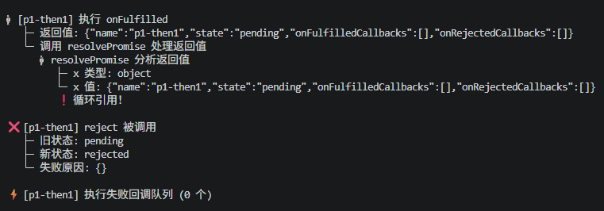
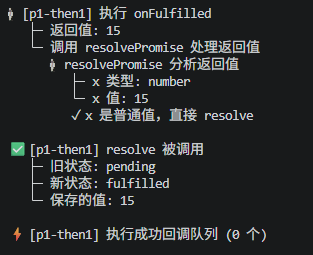
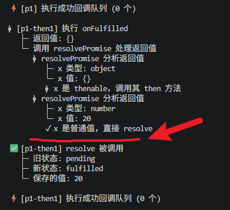

**这里面多传递了一个name参数，为了是清晰地看到不同的Promise对象的数据流转过程，不是标准的Promise API**

```javascript
class MyPromise {
  static PENDING = "pending";
  static FULFILLED = "fulfilled";
  static REJECTED = "rejected";

  constructor(executor, name = "Promise") {
    this.name = name;
    this.state = MyPromise.PENDING;
    this.value = undefined;
    this.reason = undefined;
    this.onFulfilledCallbacks = [];
    this.onRejectedCallbacks = [];

    console.log(`📦 [${this.name}] 构造函数开始执行`);
    console.log(`   └─ 初始状态: pending`);

    const resolve = (value) => {
      if (this.state === MyPromise.PENDING) {
        console.log(`\n✅ [${this.name}] resolve 被调用`);
        console.log(`   ├─ 旧状态: ${this.state}`);
        this.state = MyPromise.FULFILLED;
        console.log(`   ├─ 新状态: ${this.state}`);
        this.value = value;
        console.log(`   └─ 保存的值: ${JSON.stringify(value)}`);

        setTimeout(() => {
          console.log(
            `\n⚡ [${this.name}] 执行成功回调队列 (${this.onFulfilledCallbacks.length} 个)`,
          );
          this.onFulfilledCallbacks.forEach((callback, index) => {
            console.log(`   └─ 执行回调 ${index + 1}`);
            callback(this.value);
          });
        });
      }
    };

    const reject = (reason) => {
      if (this.state === MyPromise.PENDING) {
        console.log(`\n❌ [${this.name}] reject 被调用`);
        console.log(`   ├─ 旧状态: ${this.state}`);
        this.state = MyPromise.REJECTED;
        console.log(`   ├─ 新状态: ${this.state}`);
        this.reason = reason;
        console.log(`   └─ 失败原因: ${JSON.stringify(reason)}`);

        setTimeout(() => {
          console.log(
            `\n⚡ [${this.name}] 执行失败回调队列 (${this.onRejectedCallbacks.length} 个)`,
          );
          this.onRejectedCallbacks.forEach((callback, index) => {
            console.log(`   └─ 执行回调 ${index + 1}`);
            callback(this.reason);
          });
        });
      }
    };

    console.log(`📝 [${this.name}] 开始执行 executor`);
    try {
      executor(resolve, reject);
      console.log(`✓ [${this.name}] executor 执行完成\n`);
    } catch (error) {
      console.log(`❗ [${this.name}] executor 抛出异常: ${error.message}`);
      reject(error);
    }
  }

  then(onFulfilled, onRejected, thenName = "then") {
    // 值穿透
    onFulfilled =
      typeof onFulfilled === "function" ? onFulfilled : (value) => value;
    onRejected =
      typeof onRejected === "function"
        ? onRejected
        : (reason) => {
            throw reason;
          };

    const promiseName = `${this.name}-${thenName}`;
    console.log(`🔗 [${this.name}] 调用 then() → 创建 [${promiseName}]`);
    console.log(`   ├─ 当前状态: ${this.state}`);

    const promise2 = new MyPromise((resolve, reject) => {
      if (this.state === MyPromise.FULFILLED) {
        console.log(`   └─ Promise 已完成，将异步执行回调`);
        setTimeout(() => {
          console.log(`\n🎯 [${promiseName}] 执行 onFulfilled`);
          try {
            const x = onFulfilled(this.value);
            console.log(`   ├─ 返回值: ${JSON.stringify(x)}`);
            console.log(`   └─ 调用 resolvePromise 处理返回值`);
            resolvePromise(promise2, x, resolve, reject);
          } catch (error) {
            console.log(`   └─ 回调抛出错误: ${error.message}`);
            reject(error);
          }
        });
      }

      if (this.state === MyPromise.REJECTED) {
        console.log(`   └─ Promise 已失败，将异步执行回调`);
        setTimeout(() => {
          console.log(`\n🎯 [${promiseName}] 执行 onRejected`);
          try {
            const x = onRejected(this.reason);
            console.log(`   ├─ 返回值: ${JSON.stringify(x)}`);
            resolvePromise(promise2, x, resolve, reject);
          } catch (error) {
            console.log(`   └─ 回调抛出错误: ${error.message}`);
            reject(error);
          }
        });
      }

      if (this.state === MyPromise.PENDING) {
        console.log(`   └─ Promise 待定中，回调加入队列`);
        this.onFulfilledCallbacks.push((value) => {
          setTimeout(() => {
            console.log(`\n🎯 [${promiseName}] 从队列执行 onFulfilled`);
            try {
              const x = onFulfilled(value);
              console.log(`   ├─ 返回值: ${JSON.stringify(x)}`);
              resolvePromise(promise2, x, resolve, reject);
            } catch (error) {
              console.log(`   └─ 回调抛出错误: ${error.message}`);
              reject(error);
            }
          });
        });

        this.onRejectedCallbacks.push((reason) => {
          setTimeout(() => {
            console.log(`\n🎯 [${promiseName}] 从队列执行 onRejected`);
            try {
              const x = onRejected(reason);
              console.log(`   ├─ 返回值: ${JSON.stringify(x)}`);
              resolvePromise(promise2, x, resolve, reject);
            } catch (error) {
              console.log(`   └─ 回调抛出错误: ${error.message}`);
              reject(error);
            }
          });
        });
      }
    }, promiseName);

    return promise2;
  }

  catch(onRejected) {
    return this.then(null, onRejected, "catch");
  }

  static resolve(value) {
    if (value instanceof MyPromise) {
      return value;
    }
    return new MyPromise((resolve) => {
      resolve(value);
    }, "Promise.resolve");
  }
}

function resolvePromise(promise2, x, resolve, reject) {
  console.log(`      🔍 resolvePromise 分析返回值`);
  console.log(`         ├─ x 类型: ${typeof x}`);
  console.log(`         └─ x 值: ${JSON.stringify(x)}`);

  if (x === promise2) {
    console.log(`         ❗ 循环引用！`);
    return reject(new TypeError("Chaining cycle detected"));
  }

  if (x !== null && (typeof x === "object" || typeof x === "function")) {
    let called = false;
    try {
      const then = x.then;
      if (typeof then === "function") {
        console.log(`         🔗 x 是 thenable，调用其 then 方法`);
        then.call(
          x,
          (value) => {
            if (called) return;
            called = true;
            resolvePromise(promise2, value, resolve, reject);
          },
          (reason) => {
            if (called) return;
            called = true;
            reject(reason);
          },
        );
      } else {
        console.log(`         ✓ x 是普通对象，直接 resolve`);
        resolve(x);
      }
    } catch (error) {
      if (called) return;
      called = true;
      reject(error);
    }
  } else {
    console.log(`         ✓ x 是普通值，直接 resolve`);
    resolve(x);
  }
}
```

我们设置几个场景来看看Promise到底是怎么执行的：

【场景1】：同步立即返回

```javascript
const p1 = new MyPromise((resolve) => {
  resolve("立即成功");
}, "p1");
p1.then(
  (value) => {
    console.log("   ✓ 收到:", value);
  },
  undefined,
  "then1",
);
```

【执行过程分析】：
第一步：new MyPromise，执行MyPromise构造函数，所以一开始会打印：**[p1] 构造函数开始执行**、 **└─ 初始状态: pending**、**[p1] 开始执行 executor**

第二步：executor立即执行，那么p1这个函数里面执行了什么？，执行了`resolve("立即成功");`resolve方法，resolve先判断了状态，此时p1这个Promise的state状态为**pending**,所以根据判断，我们将会看到打印出的内容是：**[p1] resolve 被调用**、**├─ 旧状态: pending**、**├─ 新状态: fulfilled**、**└─ 保存的值: "立即成功"** ，需要注意的是，这时候保存的值是一个文本，不是函数

第三步：当resolve当中的同步任务执行完成之后，遇到一个setTimeout，setTimeout是异步任务，不会立即执行，而是注册一个异步任务，不阻塞主线程执行后续的同步任务，等同步任务执行完毕之后，调用栈此时为空，再基于[事件循环机制](<../事件循环机制(Event%20Loop)/事件循环机制(Event%20Loop).md>)，检查任务队列，发现setTImeout的回调，再执行

第四步：执行下一个同步任务`p1.then(...)`，执行.then做了哪些事？首先打印：**[p1] 调用 then() → 创建 [p1-then1]** 、**├─ 当前状态: fulfilled**，接着是创建了一个Promise对象，那就意味着还是执行MyPromise的构造函数，所以接下来打印的是：**[p1-then1] 构造函数开始执行**、**└─ 初始状态: pending**、**[p1-then1] 开始执行 executor**，判断p1当前的状态，因为前面执行了resolve，所以当前的状态是fulfilled，那么继续打印：**└─ Promise 已完成，将异步执行回调**，这时候遇到了setTimeout，异步任务加入任务队列，继续执行后续的同步任务，打印：**[p1-then1] executor 执行完成**

第五步：执行完.then之后，当前的同步任务都执行完成，调用栈清空，接下来就检查任务队列，按照队列的FIFO原则，先执行p1 resolve的异步任务，所以打印的是：**[p1] 执行成功回调队列 (0 个)**

=====================================

疑问：为什么这里的回调队列是0个？

原因：

1. 因为这里的代码是立即resolve，执行resolve('立即成功')的时候，p1.then还没有被调用，所以p1的onFulfilledCallbacks是空数组。
2. 当p1调用then的时候，state已经变成fulfilled了，没有向onFulfilledCallbacks当中push回调任务。

=====================================

第六步：开始执行队列中p1-then1的setTimeout异步任务，所以打印的是：**[p1-then1] 执行 onFulfilled**，接下来执行回调函数`onFulfilled(value)`，onFulfilled对应的回调函数是

```
value => {
  console.log('   ✓ 收到:', value)
}
```

所以，还会打印：**✓ 收到: 立即成功**，继续往下执行，打印**返回值: undefined**、**└─ 调用 resolvePromise 处理返回值**，这里undefined是因为回调函数只是打印了内容，没有返回任何值。

到了这一步，还有一个非常核心的内容**resolvePromise**

> resolvePromise 是 Promise 实现中最核心的函数之一，它是 Promise/A+ 规范的核心部分，叫做 Promise Resolution Procedure（Promise 解决程序）。

这个函数的作用就是：处理then回调的返回值，根据 then 回调的返回值 x，决定新 Promise promise2 的状态。

resolvePromise要处理以下三种情况：

【情况1】：循环引用检测

```javascript
if (x === promise2) {
  console.log(`❗ 循环引用！`);
  return reject(new TypeError("Chaining cycle detected"));
}
```

【情况2】：x是Promise或thenable对象

```javascript
if (x !== null && (typeof x === "object" || typeof x === "function")) {
  // 调用 x 的 then 方法，等待它完成
}
```

【情况3】：x是普通值

```javascript
else {
  console.log(` x 是普通对象，直接 resolve`)
  resolve(x)
}
```

举几个栗子看看：

情况1：返回普通值，我们上面模拟的p1就是这种情况，直接返回“立即成功”

```javascript
Promise.resolve(10)
  .then((v) => v * 2) // 返回 20
  .then((v) => {
    console.log(v); // 收到 20
  });
```

执行流程：

```
第一个 then:
  ├─ onFulfilled(10) 返回 x = 20
  ├─ resolvePromise(promise2, 20, resolve, reject)
  └─ 20 是普通值 → resolve(20)
       ↓
第二个 then 收到 20
```

情况2：返回Promise或者thenable对象

=========== Promise ==============

```javascript
Promise.resolve("开始")
  .then((v) => {
    return new Promise((resolve) => {
      setTimeout(() => resolve(v + "->完成"), 100);
    });
  })
  .then((v) => {
    console.log(v); // 收到 '开始->完成'
  });
```

执行流程：

```
第一个 then:
  ├─ onFulfilled('开始') 返回 x = new Promise(...)
  ├─ resolvePromise(promise2, x, resolve, reject)
  ├─ 检测到 x 是 Promise
  ├─ 调用 x.then(...)，等待它完成
  └─ 100ms 后，x resolve('开始->完成')
       ↓
resolvePromise 递归调用:
  ├─ value = '开始->完成'
  └─ '开始->完成' 是普通值 → resolve('开始->完成')
       ↓
第二个 then 收到 '开始->完成'

```

=========== thenable ==============

```javascript
Promise.resolve()
  .then(() => {
    return {
      then: function (onFulfilled, onRejected) {
        setTimeout(() => onFulfilled("来自 thenable"));
      },
    };
  })
  .then((v) => {
    console.log(v); // 收到 '来自 thenable'
  });
```

执行流程：

```
第一个 then:
  ├─ 返回 x = { then: function... }  (thenable 对象)
  ├─ resolvePromise(promise2, x, resolve, reject)
  ├─ 检测到 x 有 then 方法
  ├─ 调用 x.then(...)
  └─ thenable 的 onFulfilled 被调用
       ↓
resolvePromise 递归调用:
  └─ resolve('来自 thenable')
       ↓
第二个 then 收到 '来自 thenable'

```

情况3：循环引用（错误）

```javascript
const promise = Promise.resolve().then(() => {
  return promise; // ❌ 循环引用！
});
```

执行流程：

```
then:
  ├─ 返回 x = promise (就是 promise2 本身)
  ├─ resolvePromise(promise2, x, resolve, reject)
  ├─ 检测到 x === promise2
  └─ reject(new TypeError('Chaining cycle detected'))
```

弄清楚上面的resolvePromise具体做了哪些事情之后，我们继续下一步

第七步：先判断是否循环引用

如果循环引用，则直接reject，抛出异常，外层try/catch能够捕获到异常，会打印异常信息，我们将p1简单调整模拟看看结果：

```javascript
let p2;
const p1 = new TrackedPromise((resolve) => {
  resolve("立即成功");
}, "p1");
p2 = p1.then(
  (value) => {
    //   console.log('   ✓ 收到:', value)
    return p2;
  },
  undefined,
  "then1",
);
```

前面p1部分的执行过程和结果都不变，接下去拿到x是p2这个Promise对象：

```
 {"name":"p1-then1","state":"pending","onFulfilledCallbacks":[],"onRejectedCallbacks":[]}
```

之后打印：

**返回值: {"name":"p1-then1","state":"pending","onFulfilledCallbacks":[],"onRejectedCallbacks":[]}**

**调用 resolvePromise 处理返回值**

**├─ x 类型: object**

**└─ x 值: {"name":"p1-then1","state":"pending","onFulfilledCallbacks":[],"onRejectedCallbacks":[]}**

这一堆内容打印完成之后，开始判断x和promise2是否是同一个对象，这时发现，它们是同一个对象，打印：**❗ 循环引用！**

创建一个类型错误对象，reject出去，此时reject方法被调用，判断p1-then1（p2）的状态，这时候p2还是pending状态，所以执行结果打印的是：

```
❌ [p1-then1] reject 被调用
   ├─ 旧状态: pending
   ├─ 新状态: rejected
   └─ 失败原因: {}

[p1-then1] 执行失败回调队列 (0 个)
```



接下来我们模拟一下返回普通值的情况

```javascript
const p1 = new TrackedPromise((resolve) => {
  resolve(10);
}, "p1");

p1.then(
  (value) => {
    //   console.log('   ✓ 收到:', value)
    return value + 5;
  },
  undefined,
  "then1",
);
```

打印的结果，前面都一样，then开始稍微不同：

```
[p1-then1] 执行 onFulfilled
   ├─ 返回值: 15
   └─ 调用 resolvePromise 处理返回值
      � resolvePromise 分析返回值
         ├─ x 类型: number
         └─ x 值: 15
         ✓ x 是普通值，直接 resolve

✅ [p1-then1] resolve 被调用
   ├─ 旧状态: pending
   ├─ 新状态: fulfilled
   └─ 保存的值: 15
```



最后再模拟一下返回Promise的场景

```javascript
const p1 = new TrackedPromise((resolve) => {
  resolve(10);
}, "p1");
p1.then(
  (value) => {
    //   console.log('   ✓ 收到:', value)
    return new Promise((resolve) => {
      setTimeout(() => resolve(value * 2), 1000);
    });
  },
  undefined,
  "then1",
);
```

执行结果打印：

```
[p1-then1] 执行 onFulfilled
   ├─ 返回值: {}
   └─ 调用 resolvePromise 处理返回值
      � resolvePromise 分析返回值
         ├─ x 类型: object
         └─ x 值: {}
         � x 是 thenable，调用其 then 方法
      � resolvePromise 分析返回值
         ├─ x 类型: number
         └─ x 值: 20
         ✓ x 是普通值，直接 resolve

✅ [p1-then1] resolve 被调用
   ├─ 旧状态: pending
   ├─ 新状态: fulfilled
   └─ 保存的值: 20

⚡ [p1-then1] 执行成功回调队列 (0 个)
```



通过setTimeout来模拟异步操作，图中标记处停顿1秒

当然，没有返回值的时候，打印结果如下：

```javascript
const p1 = new TrackedPromise((resolve) => {
  resolve(10);
}, "p1");
p1.then(
  (value) => {
    console.log("   ✓ 收到:", value);
  },
  undefined,
  "then1",
);
```

```
[p1-then1] 执行 onFulfilled
   ✓ 收到: 10
   ├─ 返回值: undefined
   └─ 调用 resolvePromise 处理返回值
      � resolvePromise 分析返回值
         ├─ x 类型: undefined
         └─ x 值: undefined
         ✓ x 是普通值，直接 resolve

✅ [p1-then1] resolve 被调用
   ├─ 旧状态: pending
   ├─ 新状态: fulfilled
   └─ 保存的值: undefined
```

============================== 补充 =======================================
上面的代码案例是基于最基本的处理逻辑，为了更加清楚地知道Promise内部运行的基本原理和数据传递逻辑，那么肯定还有更多复杂的情况，完全可以按照上述逻辑来分析执行过程：

【延迟成功】

```javascript
const p2 = new TrackedPromise((resolve) => {
  setTimeout(() => resolve("延迟成功"), 100);
}, "p2");

console.log("\n--- 注意：此时 then() 在 resolve 之前被调用 ---\n");
p2.then((value) => {
  console.log("   ✓ 收到:", value);
}, "then2");
```

【链式调用】

```javascript
MyPromise.resolve(10)
  .then((v) => {
    console.log(`   ✓ 第一步收到: ${v}, 返回: ${v * 2}`);
    return v * 2;
  }, "then-A")
  .then((v) => {
    console.log(`   ✓ 第二步收到: ${v}, 返回: ${v + 5}`);
    return v + 5;
  }, "then-B")
  .then((v) => {
    console.log(`   ✓ 第三步收到: ${v}`);
  }, "then-C");
```

【Promise异步传递】

```javascript
MyPromise.resolve("开始")
  .then((v) => {
    console.log(`   ✓ 第一步收到: ${v}`);
    console.log(`   └─ 返回新的 Promise...`);
    return new MyPromise((resolve) => {
      setTimeout(() => resolve(v + "->异步"), 100);
    }, "内部-Promise");
  }, "then-D")
  .then((v) => {
    console.log(`   ✓ 第二步收到: ${v}`);
  }, "then-E");
```

【值穿透】

```javascript
MyPromise.resolve("原始值")
  .then(void 0, void 0, "then-空1")
  .then(void 0, void 0, "then-空2")
  .then((v) => {
    console.log(`   ✓ 最终收到: ${v}`);
  }, "then-有回调");
```

【错误处理】

```javascript
new MyPromise((_, reject) => {
  reject("出错了");
}, "p-error")
  .catch((reason) => {
    console.log(`   ✓ 捕获到: ${reason}`);
    console.log(`   └─ 返回: '已恢复'`);
    return "已恢复";
  }, "catch")
  .then((v) => {
    console.log(`   ✓ 继续执行收到: ${v}`);
  }, "then-恢复");
```
