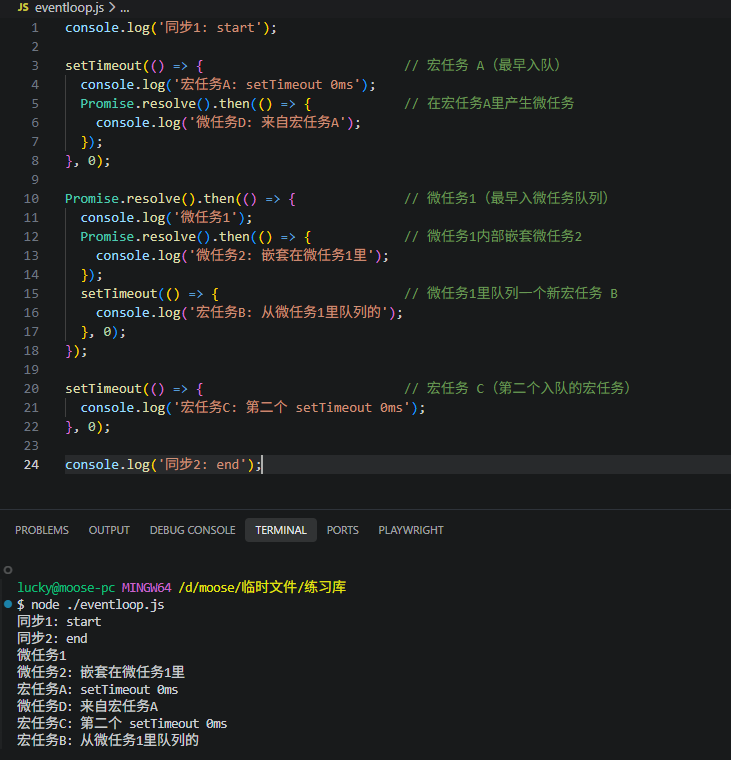
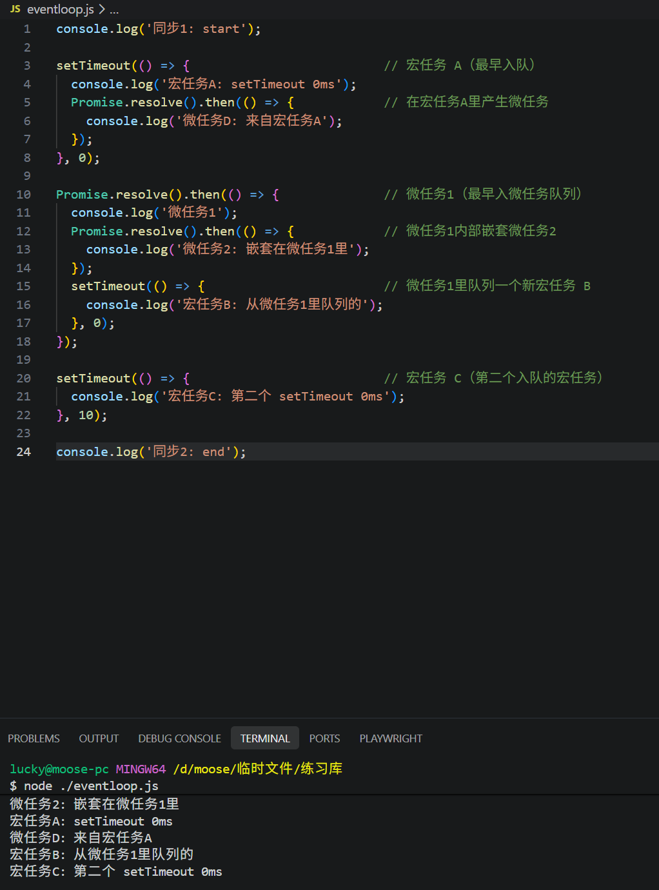

# 事件循环机制(Event Loop) -- 基于浏览器

## 简介

JavaScript是单线程语言，所有异步操作都依赖事件循环（Event Loop）,事件循环由宿主环境提供（浏览器/Node.js）提供，它管理任务队列（task queue, 宏任务）和微任务（microtask queue）。

## 核心流程（WHATWG规范算法 + MDN执行模型）：

1. 执行同步代码（调用栈）
2. 当前宏任务执行完毕且调用栈清空 --> 执行perform a microtask checkpoint（清空微任务队列）。
3. 微任务队列清空后 --> 从任务队列取下一个宏任务执行
4. 重复，直到无任务（进入等待）

| 类型   | 定义与来源                             | 执行时机                        | 示例                                                   | 优先级 |
| ------ | -------------------------------------- | ------------------------------- | ------------------------------------------------------ | ------ |
| 宏任务 | 宿主环境调度（定时器、I/O、事件）      | 当前宏任务后 + 微任务队列清空后 | setTimeout、setInterval、fetch 回调、DOM 事件、UI 渲染 | 较低   |
| 微任务 | JS 引擎调度（Promise、queueMicrotask） | 当前宏任务结束后立即全部执行    | Promise.then/catch、queueMicrotask、MutationObserver   | 最高   |

## 关键规则（WHATWG规范）

- 每一个Agent（执行环境）有一个Event Loop，包含多个task queue(按task source分组)和一个唯一的mircotask queue.
- queue a task --> 加入宏任务；queue a microtask 或 HostEnqueuePromiseJob --> 加入微任务
- 微任务必须在宏任务间隙全部清空（microtask checkpoint），即使微任务中产生新微任务也会继续执行

关于Event Loop的运行规则要怎么来理解，我们通过一段可执行代码来一步一步解释一下：

```
console.log('同步1: start');

setTimeout(() => {                          // 宏任务 A（最早入队）
  console.log('宏任务A: setTimeout 0ms');
  Promise.resolve().then(() => {            // 在宏任务A里产生微任务
    console.log('微任务D: 来自宏任务A');
  });
}, 0);

Promise.resolve().then(() => {              // 微任务1（最早入微任务队列）
  console.log('微任务1');
  Promise.resolve().then(() => {            // 微任务1内部嵌套微任务2
    console.log('微任务2: 嵌套在微任务1里');
  });
  setTimeout(() => {                        // 微任务1里队列一个新宏任务 B
    console.log('宏任务B: 从微任务1里队列的');
  }, 0);
});

setTimeout(() => {                          // 宏任务 C（第二个入队的宏任务）
  console.log('宏任务C: 第二个 setTimeout 0ms');
}, 0);

console.log('同步2: end');

```

第一步：执行当前同步代码（Call Stack清空前）

- 执行同步1，输出：**同步1：start**
- 第一个setTimeout，把宏任务A加入到定时器任务队列（位置1）
- Promise.resolve().then(...): 把微任务1加入到微任务队列
- 第二个setTimeout：把任务C加入到定时器队列（位置2）
- 执行同步2：输出：**同步2：end**

第二步：执行为任务检查点（Microtask Checkpoint）

- 从微任务队列当中取出微任务1，输出：**微任务1**
- 内部Promise.resolve().then(...): 把微任务2加入到为任务队列，仍然在checkpoint当中
- setTimeout(...)：把宏任务B加入定时器任务队列（位置3，现在宏任务队列变成了[ A, C, B]）
- 当前微任务队列还未清空，所以继续执行微任务2，输出：**微任务2: 嵌套在微任务1里**
- 微任务队列现在彻底为空，checkpoint结束，需要特别注意的是：**规范明确要求“一直执行微任务直到队列为空”，所以嵌套的微任务2必须在同一轮 checkpoint 内全部跑完，绝不会跑到宏任务后面**

第三步：微任务清空后，从宏任务队列当中（队列的按照FIFO机制）取出第一个宏任务执行，也就是宏任务A

- 执行宏任务A，输出：**宏任务A: setTimeout 0ms**
- 内部Promise.resolve().then(...)，把微任务D加入微任务队列
- 宏任务A执行完毕之后，再次触发微任务检查点：
  - 执行微任务D，输出：**微任务D: 来自宏任务A**
  - 微任务队列再次被清空

第四步：继续执行下一个宏任务C

- 输出：**宏任务C: 第二个 setTimeout 0ms**
- 无微任务产生

第五步：执行宏任务队列当中最后一个宏任务B

- 输出：**宏任务B: 从微任务1里队列的**
- 所有队列清空，事件循环进入等待

我们运行这段代码验证一下结论：



需要思考一个问题，如果这个时候，修改一下宏任务C的延迟时间，改成100ms

```
setTimeout(() => {  // 宏任务 C（第二个入队的宏任务）
  console.log('宏任务C: 第二个 setTimeout 0ms');
}, 100);
```

那么结果会是怎么样？



这里可以看出宏任务C跑到宏任务B之后执行了，这里一定要捋清楚，宏任务什么时候加入宏任务队列，要根据实际delay的时间来计算，并不是按照顺序，逐个加入宏任务队列的，关键点：**setTimeout 的任务不是立刻入队，而是“等 delay 过去后才加入队列”**
剪取一段规范对于Timers的官方说明:

> “Let startTime be the current high resolution time...

> Set global's map of active timers[ timerKey ] to startTime plus milliseconds.”

> “wait until ... milliseconds milliseconds have passed...”

> “Let completionStep be an algorithm step which queues a global task on the timer task source...”

可以简单总结为以下几点：

- 调用 setTimeout(fn, delay) 时，浏览器只记录一个“定时器”（active timer），记录到期时间 = 当前时间 + delay。
- 只有等到 delay 真正过去，浏览器才会执行“queue a global task on the timer task source”，把回调任务真正放入 Event Loop 的 timer task queue。
- delay=0 的任务几乎立刻就“到期”，立刻被队列。
- delay=100 的任务要等 100ms 后才被队列。

## 总结

- 微任务永远在“当前宏任务结束后立即全部清空”，包括中途嵌套产生的，这也是Promise、queueMicrotask、async/await的底层保证。
- 宏任务严格按入队顺序执行，这是队列FIFO机制决定的。
- 宏任务内部产生的微任务，只会在当前这个宏任务结束后立即执行，不会跳过其他宏任务。

## 补充说明

### Agent

上述提到一个Agent的概念，这里的Agent表示的是JS的执行环境，是JavaScript代码真正运行的“容器”，比如：

- 浏览器主页面（window）: 一个Agent
- 每个Web woker: 各自一个独立的Agent
- 每个iframe（同源）可以共享一个Agent

为什么这么设计呢？
原因是一个Agent里面的所有代码，包括页面、worker必须按照一致的处理逻辑进行，不能乱，乱了之后就容易出错。

### 为什么多个task queue（按task source分组）

这个概念很容易搞混，官方的表述是这样的

> For each event loop, every task source must be associated with a specific task queue.
> (对于每一个 Event Loop，每一种 task source 都必须关联到一个特定的 task queue。)

这个task source(任务源)是什么？

- 就是一个任务“类型/来源”的标签
- 常见的task source有：
  - User interaction task source（鼠标点击、键盘事件）
  - DOM manipulation task source（DOM 操作）
  - Networking task source（fetch、XHR）
  - Timer task source（setTimeout/setInterval）
  - Rendering task source（浏览器重绘）
  - . . . 等等

那么问题来了，为什么不只用一个 queue，而要按 source 分多个 queue？

其实这个问题的答案显而易见：

- 如果只有一个queue，所有任务挤在一个队列当中，网络请求的回调可能一直堵在前面，导致用户点击事件永远得不到响应，页面卡死。
- 让浏览器能够智能调度：浏览器可以先处理UI事件，用户体验优先，再处理网络请求，最后处理定时器。

再追加一个问题，task queue是多个，但是为什么microtask queue只有一个呢？它就不担心造成阻塞吗？

原因有以下几点：

- 微任务优先级更高，必须插队立即执行
- 所有微任务都是紧急的，所以它们不需要按不同类型分开
  - 每执行完一个宏任务（来自任何一个 task queue），就立刻把整个 microtask queue 清空（即使中途又产生新微任务也要继续清）。
  - 只有 microtask queue 彻底空了，才会去拿下一个宏任务。

这也是为什么 Promise.then 永远比 setTimeout 先执行，哪怕 setTimeout(0)。
