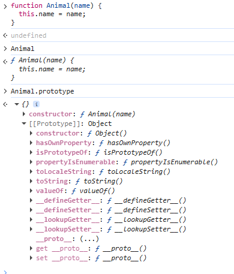
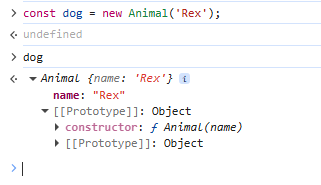
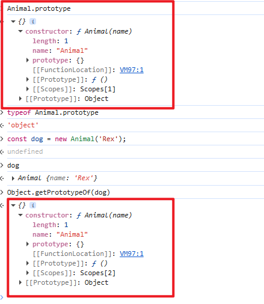
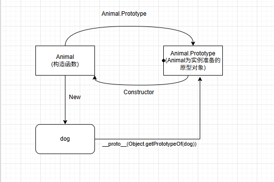
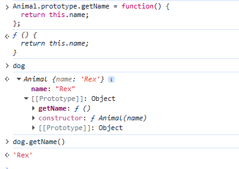
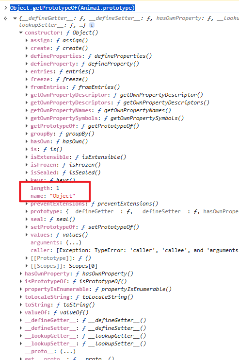
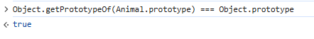
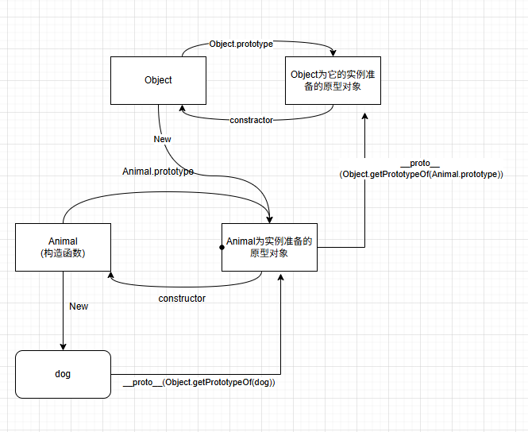
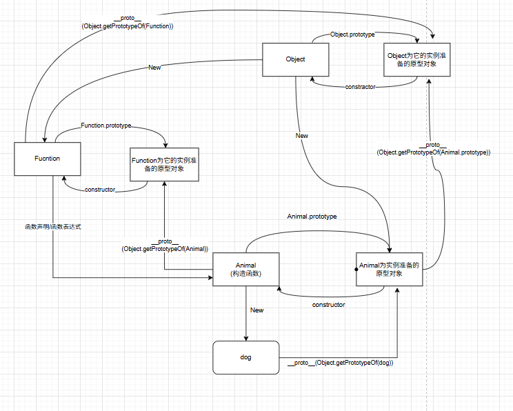

# 原型和原型链

## 背景和发展

先简单说一下原型和原型链的背景和发展：

1995年Brendan Eich在借鉴Self的原型继承模型设计了Javascript的原型继承模型，Self语言彻底抛弃“类”的概念，一切都是对象，没有类模板，只有原型（prototype）：直接复制一个现有对象（原型），然后修改它，就得到一个新对象。继承通过“委托（delegation）”实现：对象有一个“父插槽”（parent slot），如果自己没找到属性或者方法，就自动委托给父对象，类似于JS的proto

基于这种背景，JS的原型链就变成了如下的效果：

- 每个函数都有一个prototype属性（用于构造函数）
- 用new创建对象时，实例的**proto**（内部[[prototype]]）指向构造函数的prototype
- 属性查找：先自己找-->找不到就顺着**proto**链往上找（直到Object.prototype）--> 这就是原型链

在原版的基础上，ES5（2019）版本，补充了两个方法：Object.create()、Object.getPrototypeOf()正式暴露了原型操作；ES6（2015）添加了class和extends语法糖，但是底层还是原型链；JS当中的所有继承，包括Array、Promise等内置对象，都靠这个模型。

## 原型链分析

这么描述可能不够直观，我结合图和示例代码来分步讲一下：

```
function Animal(name) {
  this.name = name;
}
```

按照上面所述，Animal是一个构造函数（本质上和普通函数没什么区别），那么它肯定会有一个prototype属性，我们来打印一下看看：



通过打印Animal.prototype可以看到这个原型对象的整体结构

**这里一定要清楚一个概念，这个原型对象不是Animal的原型对象，而是Animal这个构造函数，为它的实例准备的原型对象；可以说成：Animal.prototype 是 Animal 实例的原型对象。所有函数的原型是Function.prototype**

那么我现在创建一个实例对象

```
const dog = new Animal('Rex');
```



我们通过Object.getPrototypeOf(dog)获取dog的原型对象，可以明显看到，Animal这个构造函数的属性prototype显示的原型对象和获取到的dog的原型对象是同一个



那么第一个链条出来了



```
// 1. Animal 本身的原型是谁？
console.log(Animal.__proto__ === Function.prototype);          // true
console.log(Animal.__proto__.constructor === Function);       // true

// 2. Animal.prototype 是谁的原型？
console.log(Animal.prototype.constructor === Animal);         // true

// 3. 创建实例后验证
const dog = new Animal('旺财');
console.log(dog.__proto__ === Animal.prototype);              // true ← 关键！
console.log(Object.getPrototypeOf(dog) === Animal.prototype); // true（推荐写法）

// 4. 原型链完整路径
console.log(dog.__proto__.__proto__ === Object.prototype);    // true
console.log(Animal.prototype.__proto__ === Object.prototype); // true
```

那么现在，如果我在Animal.Prototype上面注册一个getName的方法，这个时候通过dog去调用，它会发生什么？

```
Animal.prototype.getName = function() {
  return this.name;
};
```

这时候会发现，dog也能使用getName这个方法了



那么继续往下拓展，因为Animal.prototype指向的是一个为Animal实例准备的原型对象，它的本质就是一个对象，那么它的原型又是谁？

```
Object.getPrototypeOf(Animal.prototype)
```



可以看到，Animal.prototype这个的原型对象的构造函数是Object，是不是有点绕，基于上面内容，可以知道的是，Animal.prototype的原型对象肯定是Object.prototype,我们对比一下就知道了：



所以，再上一层的原型链可以这么画：



继续往下拓展，Animal这个构造函数又是谁实例化过来的？它作为对象，它是不是也是某个对象New过来的？

第一点：所有函数都是Function的实例，所有函数继承自Function对象；
第二点：Animal并不是通过New操作符从某个对象创建的，函数有其自身的特殊性，函数可以通过函数声明或者函数表达式隐形创建；

同时Function本身也是一个内置对象，它是Object实例化的产物

JavaScript 的内置原型链大致如下（以 Animal 为例）：

```
Animal.__proto__ → Function.prototype
Function.prototype.__proto__ → Object.prototype
Object.prototype.__proto__ → null
```

继续补充原型链如下：



## 总结

原型和原型链是 JS 最“非主流”却又最强大的特性，它不是 Java 的类继承，而是直接从 Self 语言的“原型 + 委托”模型抄来的。