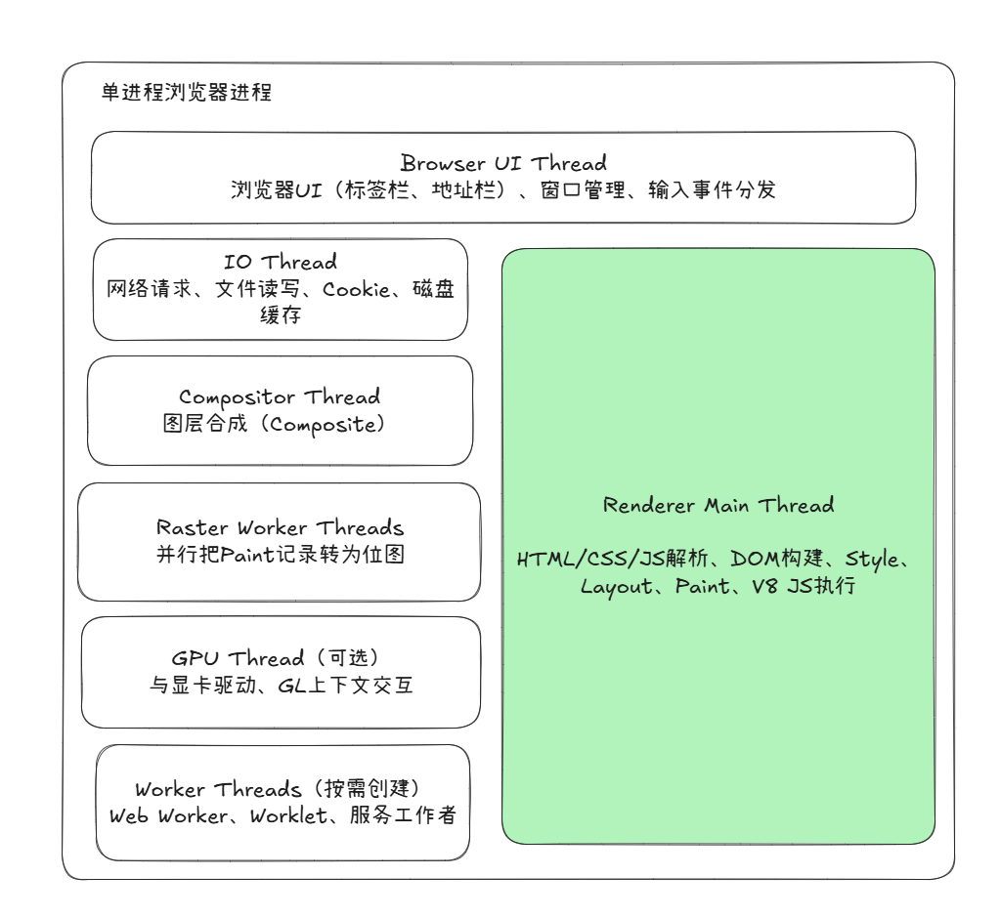
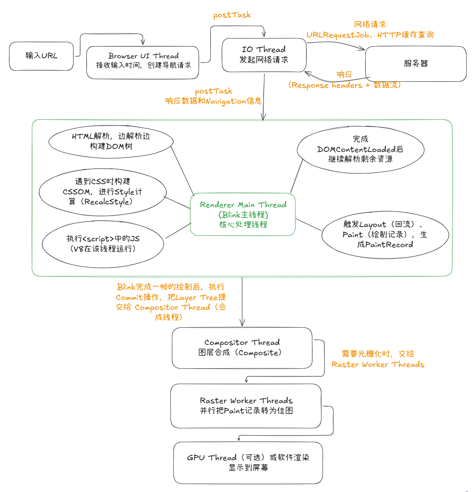

# 单进程浏览器的组成和运行方式

## 背景

在2008年Chrome推出多进程架构之前，大多数浏览器（IE6/7、早期的Firefox、Opera Presto等）都是单进程架构，整个浏览器只有一个操作系统进程，所有的标签页、插件、UI、网络都在同一个进程里运行。当然，Chrome虽然从诞生就是采用的是多进程框架，但是一直保留了`--single-process`参数，用于调试、嵌入式场景或者老设备。这个模式把渲染进程的代码跑在浏览器进程内，形成了“单进程 + 多线程”的现代混合架构。

单进程时代的浏览器（包括Chrome --single-process）本质是 **“一个进程内多个线程分工合作，通过任务队列和消息循环协同”** 的架构。核心线程包括UI线程、IO线程、Renderer主线程和Compositor线程，通过严格的任务投递（PostTask）和Sequence Checker来维持系统稳定和数据一致性。

## 整体组成

- 只有一个OS进程
- 进程内启动多个线程，各司其职
- 所有标签页共享同一块内存地址空间
- 线程间主要通过PostTask（投递任务）进行通信，而不是频繁加锁

### 主要线程组成

- Browser UI Thread（浏览器用户界面线程，主线程）：浏览器中专门负责处理用户界面（UI，标签栏、地址栏）更新和用户交互的主线程。这个线程是浏览器渲染页面、窗口管理、执行JavaScript、处理用户输入（如点击、滚动）等核心任务的地方。如果这个线程被长时间阻塞，浏览器就会出现卡顿或无响应的情况。

- IO Thread（IO线程）：专门负责处理输入/输出（Input/Output）操作的线程。这些操作可能包括从磁盘读取数据、向网络发送数据、接收用户输入等。使用独立的 IO 线程可以将耗时的 IO 操作与程序的主逻辑分离，从而提高程序的响应性和效率，避免主线程因等待 IO 完成而阻塞。

- Renderer Main Thread（Blink核心线程，渲染主线程）：处理大部分用户界面更新、JavaScript 执行、HTML 解析、CSS 样式计算和布局等关键任务。

- Compositor Thread（合成线程）：图层合成、滚动、CSS动画、Transform处理，图形渲染中的一个重要组成部分。它负责将应用程序的多个层（例如用户界面元素、图像和文本）合成为一个单一的图像，然后将其发送到显示器。这个过程通常在后台进行，以确保用户界面的流畅性和响应性。

- Raster Worker Threads（光栅工作线程）：计算机图形渲染中，负责执行光栅化任务的多个并发处理单元。光栅化是将矢量图形数据转换为屏幕上的像素点的过程。使用多个线程可以并行处理不同的部分，从而提高渲染效率和性能。

- GPU Thread：在图形处理器（GPU）上运行的单个执行单元。在GPU的并行计算架构中，一个GPU线程负责处理特定的数据块或执行特定的任务，从而实现大规模并行处理。

- Worker Threads（工作线程）：是一种在后台执行任务的机制，而不会阻塞主用户界面或应用程序的响应。

### 运行原理

浏览器启动后，会创建一个Message Loop（消息循环队列），每个重要线程都有自己的消息循环，类似一个“待办事项队列”。

1. 用户点击、键盘输入、定时器、网络响应等，都被包装成一个Task。
2. Task被投递（PostTask）到对应线程的队列中。
3. 每个线程按顺序从自己的队列里取出任务执行。
4. Chromium大量使用SequenceChecker，强制很多对象“只能在特定线程/序列上被访问”，避免多线程同时读写同一数据（这和我们上次讨论的数据一致性直接相关）。

如图可以简单看一下浏览器输入URL都经过了哪些主要的线程

加载阶段核心线程参与顺序总结：
Browser UI → IO → Renderer Main（解析+JS+Layout+Paint）→ Compositor → Raster Workers → 显示

表单输入完整线程顺序：
Browser UI Thread（接收系统事件）→ Renderer Main Thread（事件分发 + JS执行 + DOM更新 + Layout/Paint）→ Compositor Thread（合成）→ Raster Worker Threads（必要时）→ 屏幕显示

### 优缺点

#### 优点

- 内存占用更低（少了很多进程开销）。
- 线程间通信更快（PostTask比跨进程IPC轻量）。
- 便于调试（所有代码都在一个进程里，容易打断点）

#### 缺点

- 稳定性差：一个页面崩溃或插件挂掉可能导致整个浏览器崩溃。
- 安全性差：没有进程隔离，恶意页面理论上更容易攻击其他页面。
- 性能隔离差：一个标签页执行重度JS会卡住其他所有标签页。

这也是为什么Chrome最终选择了多进程架构（每个站点/标签页尽量独立进程）。

### 结论：

- Renderer Main Thread 是整个过程中最繁忙也最容易成为瓶颈的线程。无论是页面加载、JS执行，还是表单输入事件处理，几乎所有“业务逻辑”都必须在该线程串行执行。
- Chromium通过PostTask + SEQUENCE_CHECKER确保数据访问尽量序列化，避免多线程直接竞争同一份DOM数据。
- 只有合成阶段（Compositor）可以相对独立运行，这也是为什么输入框打字时，页面其他部分的滚动有时仍能保持流畅（如果没有重绘）。
