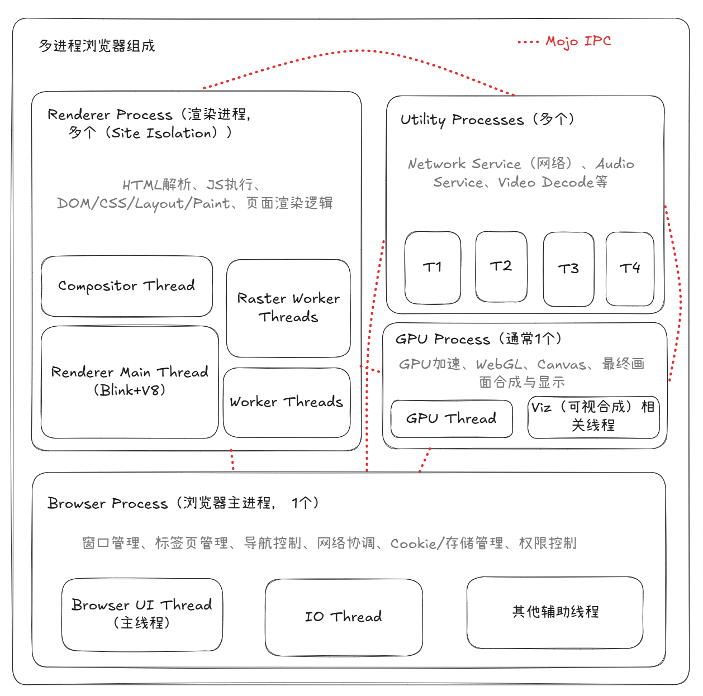

# 多进程浏览器的组成和运行方式

## 背景

Chrome从2008年发布起就采用多进程架构，经过十多年演进，目前形成了Browser Process + 多个Renderer Processes + GPU Process + 若干Utility Processes的成熟架构，并通过Site Isolation策略强化隔离。

单进程模式最大的问题是一个页面崩溃或卡死可能导致整个浏览器挂掉，同时安全性差（没有OS级进程隔离）。多进程把不同站点、不同功能拆到不同OS进程中，实现：

- 崩溃隔离（一个标签页崩溃不影响其他）
- 安全沙箱（Renderer进程权限极低）
- 更好的资源调度
- 代价是内存占用更高、进程间通信（IPC）有额外开销。

## 整体组成

