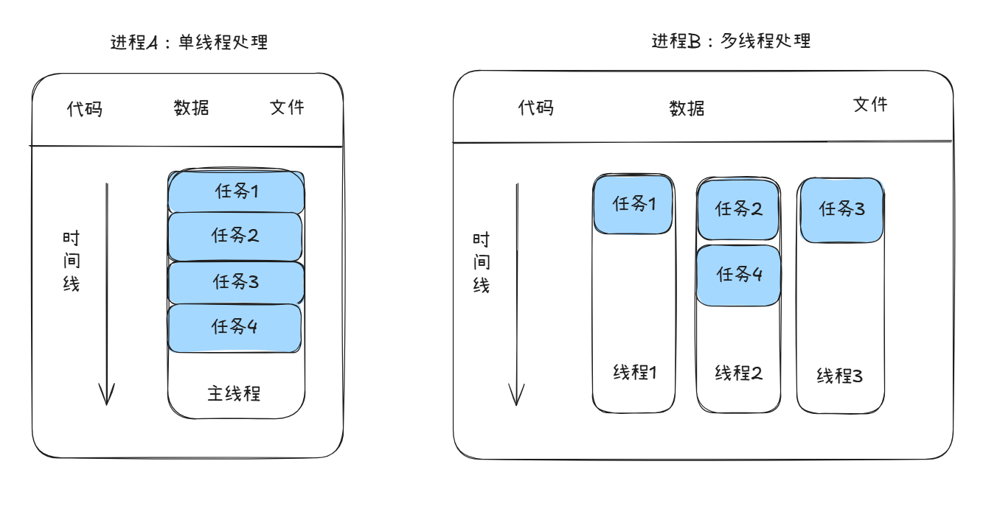
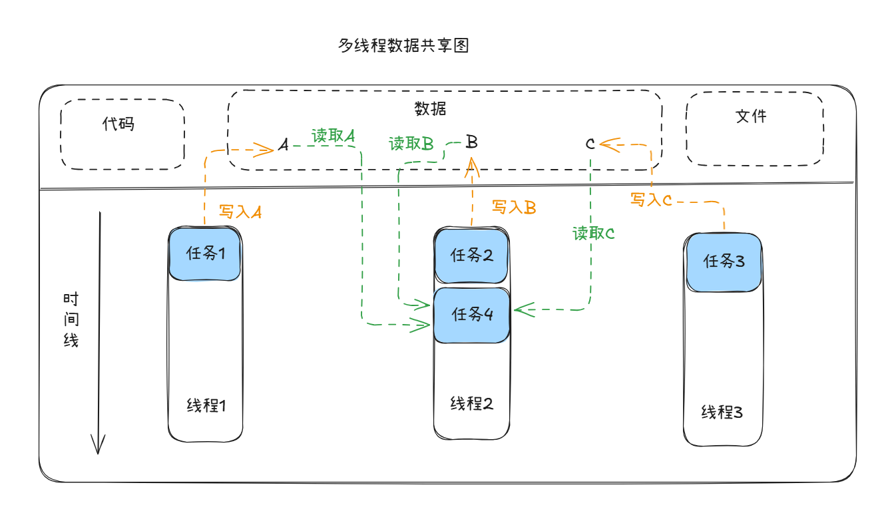
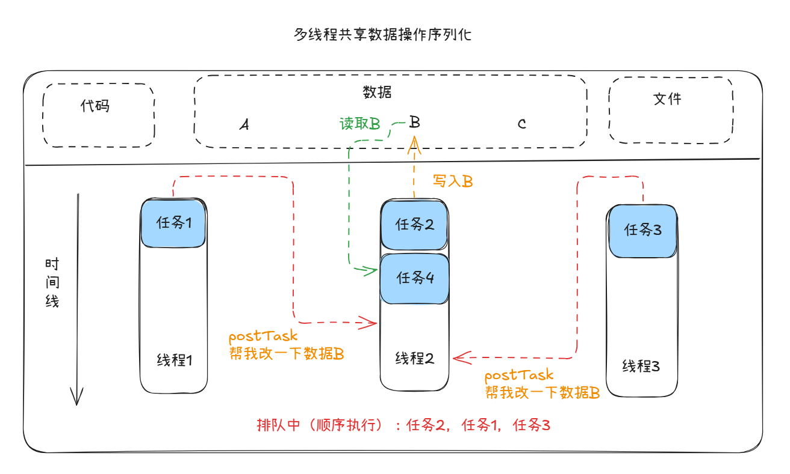

# 浏览器工作原理

## 前置说明

文章内容参考：https://juejin.cn/post/6846687590540640263 （来自掘进TianTianUp）本文参照原作者文章对知识点的讲述逻辑，在原文章内容的基础上补充了一些自己想要记录的内容，仅供学习和参考，因为涉及到比较多的相同文本描述、参考图等内容，如果作者认为侵权，可以联系删除，谢谢！

## 进程与线程

在了解浏览器的工作原理之前，我们需要清楚浏览器运行的两个核心概念，进程和线程。

进程是程序的运行实例，我们可以理解为一个“运行空间”，一个进程就死一个程序的运行实例，启动一个程序的时候，操作系统会为该程序创建一块内存，用来存放代码、运行中的数据和一个执行任务的主线程，我们把这样的一个运行环境叫进程。线程是由进程来启动和管理的，它不能单独存在。

如图所示：



### 进程与线程之间的关系

1. 进程中的任意一线程执行出错，都会导致整个进程的崩溃。
2. 线程之间共享进程中的资源，其中最核心的是共享数据，同时也共享一些其他内容，比如进程ID、打开文件的描述符（并发写文件）、全局变量/静态变量、代码段（可执行指令、函数机器码等）



- 当一个进程关闭之后，操作系统会回收进程所占用的内存
- 进程之间的内容相互隔离

#### 数据共享一致性问题？

多线程共享数据的情况下，是否会出现数据不一致的情况？比如上图中显示的，如果任务1也会更新和读取B的数据，那么任务4在读取B的时候，是否会出现与我们预期的结果不一致的情况，浏览器是如何避免这种情况的？

Chrome（包括单进程模式 --single-process）在同一个进程内使用多个线程（如 UI 线程、IO 线程、渲染主线程、Compositor 线程等）。这些线程共享同一块虚拟内存地址空间，理论上可以直接读写同一块内存，但这极易导致数据竞争（race condition）：读到脏数据、更新丢失、指针失效、崩溃等。

首先，Chromium 从设计哲学上就极力避免在多个线程直接共享可变（mutable）状态。而是采用“序列化访问”的方式进行处理，我们几个栗子就知道了：

> 就好比一个共享的表格，你不要让好几个工人同时伸手去改这张表格。
> 最好的办法是：这张表格只属于一个工人（一个线程/序列）。其他工人想改，就排队发个“请你帮我改成xxx”的消息（PostTask），由管理员按顺序一个一个处理。



具体的机制是：

```
1. 大量对象绑定到一个SequencedTaskRunner（可以是单线程的，也可以是同序列保证顺序）。

2. 对象内部会放一个 SEQUENCE_CHECKER(sequence_checker_); 在Debug模式下，任何不在正确序列上调用的代码会直接DCHECK崩溃。

3. 所有对该数据的读写都通过 task_runner->PostTask(FROM_HERE, base::BindOnce(&Object::Modify, this, param));

4. 任务队列内部：SequenceManager会维护任务队列，队列的入队/出队是线程安全的（内部用了必要的锁或lock-free技术），但业务数据本身在执行时是单线程的，无需再加业务锁。
```

当然特殊情况下也会使用到“锁”，但是总体原则是：

- 能用PostTask序列化解决的，绝不用锁。
- 能用原子解决的，尽量不用mutex。
- 所有可能出错的地方都有Thread/Sequence Checker做防御性检查。
- 大量使用“消息传递”而非“共享内存可变状态”。

如果想了解一下单进程浏览器的相关内容，可以看看这篇文章：
[单进程浏览器的组成和运行方式](./单进程浏览器的组成和运行方式.md)

