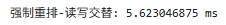
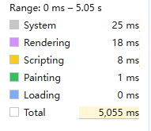
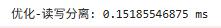
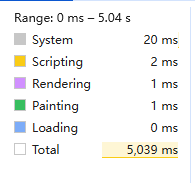
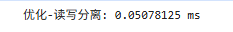
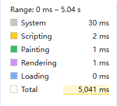

# 浏览器渲染原理

## 概念

浏览器渲染是一个多阶段流水线过程（Critical Rendering Path），核心目标是将HTML/CSS/JS转换成屏幕像素。

## 渲染流程

=========== 第一步：HTML解析-->DOM树 =======================

浏览器在收到HTML字节流后，通过HTML解析器（HTML Parser）构建DOM树。每个HTML标签成为一个节点（Node），文本内容成为文本节点，根节点为document。解析过程是增量的（Streaming），遇到 `<script>` 可能阻塞（除async/defer）。DOM树只描述文档结构，不含样式。

=========== 第二步：CSS解析--> CSSOM树 =======================

CSS（包括`<style>`、外部CSS、inline style、 User Agent样式）被CSS解析器解析成CSSOM树。CSSOM是层叠规则树，包含所有选择器、属性和计算后的样式。解析同样是阻塞的（CSS会阻塞渲染）

=========== 第三步：Render Tree（渲染树） =======================

DOM树+CSSOM树合并生成Render Tree（也叫渲染树或者Layout Tree（布局树）的前身）。只包含可见节点（display:none的节点及<head>、<meta>等不参与渲染；visibility:hidden仍参与但不显示）。每个Render Object节点包含对应DOM节点的样式信息（Computed Style）。这是“内容+样式”的可视化表示。

=========== 第四步：Layout（布局/重排/回流，Reflow/Relayout）

根据Render Tree计算每个节点在视口（viewport）内的精确几何信息（位置、尺寸、行高、盒模型等），生成Layout Tree。**这时开销最大的阶段之一**。

触发条件：修改几何属性（如width、height、margin、padding、position、display、font-size、float等）或添加/删除DOM节点、窗口resize、字体加载完成等。

影响：全局重排（整个页面）或局部重排（子树）。现代浏览器优化为“只重排受影响的部分”。

=========== 第五步：Paint（绘制/重绘，Repaint） =======================

将Layout Tree转为屏幕上的像素（位图）。生成绘制记录（Paint Records），包括背景、边框、文字、阴影等。

触发条件：修改非几何样式（如background-color、color、visibility、box-shadow、outline等），但不改变布局。开销小于重排，但仍需遍历绘制列表。

=========== 第六步：Composite（分层合成） =======================

现代浏览器引入Layer Tree（分层树）：将页面拆分为多个独立图层（Layer），如有will-change: transform、transform: translateZ(0)、opacity、CSS滤镜、video等会提升为独立合成层。

每个层独立光栅化（Rasterize）→ 合成线程（Compositor Thread）在GPU上合成最终图像。

优势：只重绘/合成受影响层，避免全页面重排重绘（动画丝滑的关键）。

触发：层属性变化或新层创建。优化方向：合理使用合成层（避免过多层导致内存压力）。

基于上面的渲染过程：减少DOM操作（批量修改、用DocumentFragment）、使用CSS硬件加速（transform/opacity）、避免强制同步布局（offsetWidth等读写混用）。

那么我们来举例说明一下，我们在平时编码过程中如何来避免这些性能的损耗：

## 案例说明

### 触发Layout（重排/Reflow）-- 强执同步布局，这时最耗性能的

```html
<!-- 测试HTML -->
<div id="box" style="width:100px;height:100px;background:red;"></div>
```

```javascript
const box = document.getElementById("box");

console.time("强制重排-读写交替");
for (let i = 0; i < 1000; i++) {
  box.style.width = i + "px"; // 写入几何属性（触发重排）
  const _ = box.offsetWidth; // 读取布局信息 → 强制同步布局
}
console.timeEnd("强制重排-读写交替");
```

打印结果：



Performance显示：



我们改成读写分离试试

```javascript
console.time("优化-读写分离");
const widths = [];
for (let i = 0; i < 1000; i++) widths.push(i + "px");

// 直接设置，不需要 rAF 包装
box.style.width = widths[widths.length - 1]; // 只触发1次重排
console.timeEnd("优化-读写分离");
```

打印结果：



Performance显示：



那么我们再试试`requestAnimationFrame`方案

```javascript
console.time("requestAnimationFrame");
const widths = [];
for (let i = 0; i < 1000; i++) widths.push(i + "px");

requestAnimationFrame(() => {
  box.style.width = widths[widths.length - 1]; // 只触发1次重排
});
console.timeEnd("requestAnimationFrame");
```

打印结果：



Performance显示：



**从打印结果分析：**

单纯从打印的执行时间上的差异还是比较明显的，看上去requestAnimationFrame方案好像是最优的，但是这种打印方式的判断显然存在明显缺陷：

因为`requestAnimationFrame` 的回调是异步的会在下一帧之前执行，所以 console.timeEnd 执行时，实际的 DOM 操作还没有发生！另外读写分离这种是具有参考性的，因为都是同步任务。

**从Performance结果分析：**

从Performance里可以看出来，后面两种方案在script(JS 执行、编译、解析)和Rendering(样式计算、布局、绘制)两个指标在时间上有明显下降，但是`requestAnimationFrame`的System有明显升高，为什么会出现这种情况？

还是因为`requestAnimationFrame` 需要向浏览器注册回调，涉及事件循环调度，rAF需要等待VSync信号，涉及合成器线程通信，所以增加了调度层面的System开销

那么按照上面的说法，是不是直接设置（读写分离）这种方式就优于`requestAnimationFrame`了呢？不能这么武断，否则`requestAnimationFrame`还有什么存在的价值呢。我只能说因场景而定：

- 场景1：动画/连续帧更新 推荐使用`requestAnimationFrame`
- 场景2：在短时间内更新多个元素 推荐使用 `requestAnimationFrame` 批量处理
- 场景3：只有1-2次简单更新，使用直接设置（读写分离），比如我们例子当中的单次更新

### 触发 Paint（重绘/Repaint）-- 只改非几何样式

```javascript
// 接上面box
console.time("重绘");
for (let i = 0; i < 1000; i++) {
  box.style.backgroundColor = i % 2 === 0 ? "blue" : "green"; // 只改颜色
  // 注意：不读取任何几何属性（如offsetWidth）
}
console.timeEnd("重绘");
```

### 触发 Composite（分层合成）-- GPU硬件加速（推荐动画写法）

```css
#box {
  will-change: transform; /* 提示浏览器提前创建合成层 */
  transition: transform 0.3s linear;
}
```

```javascript
console.time("合成");
for (let i = 0; i < 1000; i++) {
  box.style.transform = `translate3d(${i}px, 0, 0)`; // 或 translateZ(0)
  // 甚至 opacity 变化也只走 Composite
}
console.timeEnd("合成");
```

Layers面板中 `#box` 被提升为独立合成层（黄色边框），Performance中只有 Composite（蓝色条），几乎0ms主线程耗时，动画丝滑。如果改 left 或 width，会强制走 Layout + Paint + Composite（卡顿）

### Performance API 实时监控渲染流程（Web Vitals 常用）

```javascript
// 1. 标记渲染起点
performance.mark("render-start");

// 2. 执行DOM操作（重排/重绘/合成）...
for (let i = 0; i < 1000; i++) {
  box.style.transform = `translate3d(${i}px, 0, 0)`; // 或 translateZ(0)
  // 甚至 opacity 变化也只走 Composite
}
// 3. 获取渲染关键指标
const paints = performance.getEntriesByType("paint");
console.table(paints); // First Paint / First Contentful Paint

const lcp = performance.getEntriesByType("largest-contentful-paint");
if (lcp.length) console.log("LCP 时间：", lcp[0].startTime, "ms");

const measures = performance.measure("渲染总耗时", "render-start");
console.log("自定义渲染时长：", measures.duration, "ms");

// 4. 清空（避免内存泄漏）
performance.clearMarks();
performance.clearMeasures();
```

提供个完整例子可以自己试试效果

```html
<!DOCTYPE html>
<html lang="zh-CN">
  <head>
    <meta charset="UTF-8" />
    <title>渲染流程演示</title>
    <style>
      #test {
        width: 200px;
        height: 200px;
        background: red;
        margin: 50px;
        transition: all 0.3s;
        will-change: transform; /* 合成层 */
      }
      button {
        margin: 10px;
      }
    </style>
  </head>
  <body>
    <div id="test"></div>
    <button onclick="triggerReflow()">触发重排（坏）</button>
    <button onclick="triggerRepaint()">触发重绘</button>
    <button onclick="triggerComposite()">触发合成（好）</button>

    <script>
      const el = document.getElementById("test");
      performance.mark("demo-start");

      function triggerReflow() {
        for (let i = 0; i < 500; i++) {
          el.style.width = 200 + i + "px";
          void el.offsetWidth; // 强制重排
        }
      }
      function triggerRepaint() {
        for (let i = 0; i < 500; i++)
          el.style.backgroundColor = i % 2 ? "blue" : "red";
      }
      function triggerComposite() {
        for (let i = 0; i < 500; i++) el.style.transform = `translateX(${i}px)`;
      }

      // 结束后监控
      setTimeout(() => {
        const lcp = performance.getEntriesByType("largest-contentful-paint");
        console.log("本页LCP：", lcp[0]?.startTime || "未触发");
      }, 1000);
    </script>
  </body>
</html>
```
