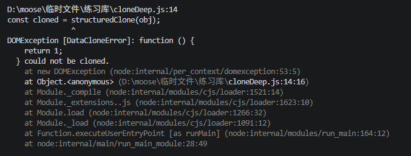

# 深拷贝和浅拷贝

## 概念以及根本性区别

### 浅拷贝

创建一个新对象，新对象是原对象的引用拷贝。如果原对象的属性是基本类型，拷贝的就是值；如果属性是引用类型，拷贝的就是内存地址（指针）。

```javascript
let obj1 = { a: 1, b: { c: 2 } };
let obj2 = Object.assign({}, obj1); // 浅拷贝
obj2.b.c = 999;
console.log(obj1.b.c); // 999 - 被影响了！
```

### 深拷贝

创建一个新对象，将原对象的所有属性（包括嵌套对象）递归地拷贝一份，新对象与原对象完全独立，互不影响。

```javascript
let obj1 = { a: 1, b: { c: 2 } };
let obj2 = JSON.parse(JSON.stringify(obj1)); // 深拷贝
obj2.b.c = 999;
console.log(obj1.b.c); // 2 - 不受影响
```

## 手写深拷贝（支持循环引用）

```javascript
function cloneDeep(obj, map = new WeakMap()) {
    /**
     * WeakMap 的优势：
        键必须是对象，正好适合存储对象引用
        弱引用：当对象被回收时，映射自动清除，不会造成内存泄漏
     */
  // 处理基本类型和null
  if (obj === null || typeof obj !== "Object") {
    return obj;
  }
  // 处理Date对象
  if (obj instanceof Date) {
    return new Date(obj);
  }

  // 处理RegExp对象
  if(obj instanceof RegExp){
    rturn new RegExp(obj);
  }

  // 检查循环引用，如果当前对象已经被拷贝过，直接返回之前拷贝的结果
  if(map.has(obj)){
    return map.get(obj);
  }

  // 初始化拷贝结果：根据原对象类型决定创建数组还是对象
  const cloneObj = Array.isArray(obj) ? [] : {}

  // 记录当前对象到映射表：在递归之前先存入，防止后续循环引用时无限递归
  map.set(obj, cloneObj);

  // 遍历并递归拷贝所有属性
  for(let key in obj){
    if(obj.hasOwnProperty(key)){ // 只拷贝自身属性，不拷贝原型链上的
        cloneObj[key] = cloneDeep(obj[key], map);
    }
  }

  // 处理Symbol类型的键：for in无法遍历Symbol键，需要单独处理
  const symbolkeys = Object.getOwnPropertySymbols(obj);
  for(let symKey of symbolKeys){
    cloneObj[symKey] = cloneDeep(obj[symKey], map)
  }

  return cloneObj;
}
```

我们来验证一下这个深拷贝的方法是否有效

```javascript
// 测试用例
const original = {
  num: 1,
  str: "hello",
  bool: true,
  null: null,
  undef: undefined,
  date: new Date(),
  regex: /test/gi,
  arr: [1, 2, { nested: "value" }],
  obj: { a: { b: { c: 123 } } },
  [Symbol("id")]: "symbol-value",
};

// 创建循环引用
original.self = original;
original.arr.push(original);

const cloned = deepClone(original);
```

结果：

```
console.log(cloned.self === cloned); // true - 循环引用正确处理
console.log(cloned === original); // false - 不是同一对象
console.log(cloned.obj.a.b.c); // 123 - 深拷贝成功
cloned.obj.a.b.c = 456;
console.log(original.obj.a.b.c); // 123 - 原对象不受影响
```

## 我们常见的深拷贝和浅拷贝的方法

### 浅拷贝

1. ES6的展开运算符`...`

```javascript
// 数组
const arr1 = [1, 2, { a: 3 }];
const arr2 = [...arr1];

// 对象
const obj1 = { a: 1, b: { c: 2 } };
const obj2 = { ...obj1 };

arr2[2].a = 999;
console.log(arr1[2].a); // 999 - 嵌套对象是引用
```

2. Object.assign()

```javascript
const obj1 = { a: 1, b: { c: 2 } };
const obj2 = Object.assign({}, obj1);
// Object.assign(target, ...sources)
```

3. Array.prototype.slice()

```javascript
const arr1 = [1, 2, { a: 3 }];
const arr2 = arr1.slice(); // 或 arr1.slice(0)
```

4. Array.prototype.concat()

```javascript
const arr1 = [1, 2, { a: 3 }];
const arr2 = arr1.concat();
const arr3 = [].concat(arr1);
```

5. Array.from()

```javascript
const arr1 = [1, 2, { a: 3 }];
const arr2 = Array.from(arr1);
```

6. Object.create()

```javascript
const obj1 = { a: 1, b: 2 };
const obj2 = Object.create(
  Object.getPrototypeOf(obj1),
  Object.getOwnPropertyDescriptors(obj1),
);
```

### 深拷贝

1. JSON.parse(JSON.stringify())

```javascript
const obj = {
  a: 1,
  b: { c: 2 },
  d: new Date(),
  e: undefined,
  f: function() {},
  g: /test/
};

const cloned = JSON.parse(JSON.stringify(obj));
// 结果: { a: 1, b: { c: 2 }, d: "2024-01-01T..." }
// 丢失: undefined、function、RegExp (转成空对象 {})
// Date 变成字符串
// 循环引用报错
···
```

2. structuredClone() (浏览器原生 API)

```javascript
const obj = {
  a: 1,
  b: { c: 2 },
  d: new Date(),
  e: /test/gi,
  f: function () {
    return 1;
  },
  s: [new Set([1, 2])],
};

// 支持循环引用
obj.self = obj;
const cloned = structuredClone(obj);
//  支持: Date、RegExp、Map、Set、循环引用
//  不支持: function、Error对象、DOM节点
```



3. Lodash \_.cloneDeep() 第三方库

```javascript
import _ from "lodash";

const obj = { a: 1, b: { c: 2 } };
const cloned = _.cloneDeep(obj);
// 功能最完善，处理各种边界情况
```

4. jQuery $.extend()

```javascript
// jQuery 方式
const cloned = $.extend(true, {}, original);
// 第一个参数 true 表示深拷贝
```
