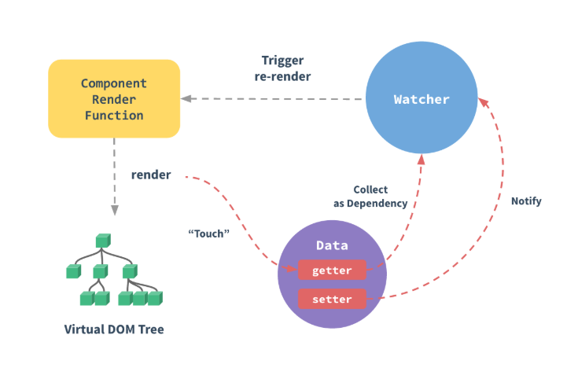

# vue响应式原理

## 概念

响应式是一种声明式处理变化的编程方式，这啥意思呢这？


我们可以这么理解，用过excel的应该知道有这么一种场景，比如有个单元格A2，设置了计算方法是A0+A1，当修改A0或者A1的时候，A2自动更新，这个就可以理解为响应式，这也是vue3官方提供的例子，当然javascript默认是没有这个特性的，Vue通过响应式系统实现这种响应效果。

## 核心机制

vue响应式系统基于以下三个核心步骤：

- Track（追踪）：当变量被读取时，记录谁在使用它
- Trigger（触发）：当变量被修改时，通知所有依赖它的副作用重新执行
- Effect(副作用)：被追踪的函数（如组件渲染函数）

## 底层数据结构

```
WeakMap<target, Map<key, Set<effect>>>
```

- 第一层: WeakMap 存储目标对象 → 依赖映射
- 第二层: Map 存储对象的 key → 订阅者集合
- 第三层: Set 存储订阅该属性的所有副作用函数

## vue2与vue3响应式原理对比

| 对比维度     | Vue2                                   | Vue3                       |
| ------------ | -------------------------------------- | -------------------------- |
| 核心技术     | Object.defineProperty                  | Proxy                      |
| 实现方式     | get/set                                | Proxy拦截                  |
| 初始化时机   | 遍历对象所有属性转为getter/setter      | 创建代理对象，按需拦截     |
| 数组响应式   | 重写了数组7个方法                      | Proxy自动拦截数组操作      |
| 动态添加属性 | 需要Vue.set() 或 this.$set()           | Proxy自动支持              |
| 对象属性删除 | 需要Vue.delete()                       | Proxy自动拦截delete操作    |
| 性能         | 初始化时底柜遍历所有属性，初始化开销大 | 惰性代理，只代理需要的层级 |
| Map/Set支持  | 无法响应式                             | 完全支持                   |
| 浏览器支持   | 不支持IE8（ES5限制）                   | 不支持IE11（ES6 Proxy）    |

接下来我们通过示例来理解一下上述这些内容：

### vue2示例



```javascript
// vue2 使用Object.definePrototype(直接在一个对象上定义一个新属性，或修改其现有属性，并返回此对象)
function defineReactive(obj, key, val) {
  const dep = new Dep();
  Object.defineProperty(obj, key, {
    get() {
      if (Dep.target) {
        dep.depend(); // 收集依赖
      }
      return val;
    },
    set(newVal) {
      if (val !== newVal) {
        val = newVal;
        def.notify(); // 触发更新
      }
    },
  });
}
```

根据代码可以看到这种方案的局限性非常明显：

- 无法检测对象属性的新增和删除
- 无法检测通过索引直接设置数组项
- 需要在data中预先声明所有响应式属性

### vue3示例

```javascript
// Vue 3 使用 Proxy
function reactive(obj) {
  return new Proxy(obj, {
    get(target, key) {
      track(target, key); // 收集依赖
      return target[key];
    },
    set(target, key, value) {
      target[key] = value;
      trigger(target, key); // 触发更新
      return true;
    },
  });
}
```

- 动态添加/删除属性自动响应式
- 支持 Map、Set、WeakMap、WeakSet
- 性能更好（惰性代理）
- 可以拦截更多操作（has、ownKeys 等）

## 异步更新队列

Vue 的 DOM 更新是异步的：

- 数据变化时，Vue 开启一个队列缓冲同一事件循环内的所有变更
- 去重重复的 watcher
- 下一个事件循环 tick 中统一执行更新

```javascript
// 等待 DOM 更新完成
this.message = "new message";
console.log(this.$el.textContent); // 仍然是旧值

this.$nextTick(() => {
  console.log(this.$el.textContent); // 新值
});
```

[vue2响应式原理（官方）](https://v2.cn.vuejs.org/v2/guide/reactivity.html)

[vue3响应式原理（官方）](https://cn.vuejs.org/guide/extras/reactivity-in-depth)
