# 快速搭建react项目（基建）

快速搭建一个基于Vite8+zustand+shadcn/ui + Tailwind CSS+代码规范化配置的React19项目

## 初始化

```bash
pnpm create vite@latest my-app -- --template react-ts
```

## 技术选型

| 类别     | 技术选择                  | 说明                 |
| -------- | ------------------------- | -------------------- |
| 核心框架 | React 19 + TypeScript     | 已有                 |
| 构建工具 | Vite 8                    | 已有                 |
| 状态管理 | Zustand / Jotai           | 轻量级，适合中小项目 |
| UI组件库 | shadcn/ui + Tailwind CSS  | 可定制、现代设计     |
| 文件处理 | 文件转换库合集            | 见下文               |
| 样式方案 | Tailwind CSS              | utility-first        |
| 路由     | React Router v7           | 如需多页面           |
| 代码规范 | ESLint + Prettier + Husky | 已有ESLint需补充     |

## 搭建步骤

### 规范化配置

#### prettier安装与配置

安装prettier

```bash
pnpm add -D prettier

```

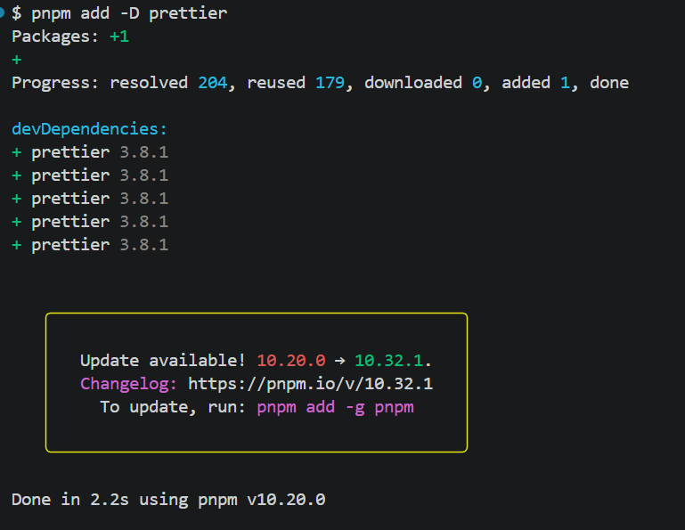

在项目根目录创建 `.prettierrc` 文件：

```json
{
  "semi": true,
  "singleQuote": true,
  "tabWidth": 2,
  "trailingComma": "all",
  "printWidth": 100,
  "arrowParens": "always",
  "bracketSpacing": true,
  "endOfLine": "lf",
  "htmlWhitespaceSensitivity": "ignore",
  "jsxSingleQuote": false,
  "proseWrap": "preserve"
}
```

简单解释一下为什么这么配置：

- **semi: true** 在语句末尾添加分号，示例：`const a = 1;` 而不是 `const a = 1`
  > 很多地方推荐使用`semi: false`,可能是受`Airbnb规范`的影响比较多，包括函数式编程FP风格更倾向于省略分号，但是我依然建议使用分号，这样可以不需要记住ASI的边缘情况，对新手友好，减少争议，代码审查的时候能清晰看到语句边界，review更加容易，当然也是Typescript官方推荐的方式。
- **singleQuote: true** 使用单引号代替双引号，示例：`'hello'` 而不是 `"hello"`
- **tabWidth: 2** 缩进空格数为 2 个空格，代码缩进使用 2 个空格而不是 4 个
- **trailingComma: "all"** all 会在所有允许的地方添加尾随逗号（包括函数参数、调用等），便于代码版本管理，添加新元素时不会产生额外的 diff，示例：`func(a, b,)` 多行函数调用更清晰
- **printWidth: 100** 每行代码的最大长度限制为 100 字符，超过这个长度会自动换行
- **arrowParens: "always"** 箭头函数的参数总是用括号包裹，示例：`(x) => x + 1` 而不是 `x => x + 1`
- **bracketSpacing: true** 在对象字面量的大括号内添加空格，示例：`{ a: 1 }` 而不是 `{a: 1}`，提高代码可读性，让对象结构更清晰
- **endOfLine: "lf"** 使用 LF（Unix 风格）换行符，跨平台一致性，Git 项目中推荐使用 LF，避免 Windows 的 CRLF 和 Unix 的 LF 混用导致的 diff 问题
- **htmlWhitespaceSensitivity: "ignore"** 忽略 HTML 中的空白敏感性，让 Prettier 自动格式化 HTML/JSX 中的空白，使模板代码更整洁
- **jsxSingleQuote: false** JSX 属性使用双引号，示例：`<div className="box">` 而不是 `<div className='box'>`，符合 React 社区惯例，HTML 属性通常使用双引号，与单引号的 JavaScript 字符串形成区分
- **proseWrap: "preserve"** 保持 Markdown 等纯文本的原始换行，在格式化 Markdown 文件时保留作者的换行意图

在项目根目录创建 .prettierignore 文件，对文件中配置的内容不进行Prettier规范格式处理：

```
node_modules
dist
pnpm-lock.yaml
package-lock.json
```

#### ESLint的安装和配置

```bash

pnpm add -D eslint-config-prettier eslint-plugin-prettier

```

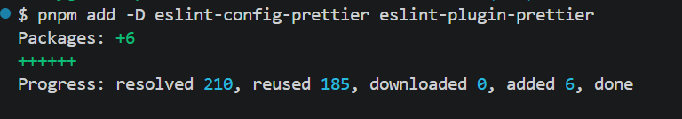

修改eslint.config.js,在extends数组最前面添加：

```javascript
import prettier from "eslint-plugin-prettier";

export default defineConfig([
  {
    // ... 其他配置
    extends: [
      "prettier", // 放在最前面，禁用与 Prettier 冲突的规则
      js.configs.recommended,
      // ...
    ],
    plugins: {
      prettier,
    },
    rules: {
      "prettier/prettier": "error",
    },
  },
]);
```

在`package.json`的script中添加格式化脚本：

```json
{
  "scripts": {
    "format": "prettier --write .",
    "format:check": "prettier --check ."
  }
}
```

配置`eslint.config.js`

```javascript
import js from "@eslint/js";
import globals from "globals";
import reactHooks from "eslint-plugin-react-hooks";
import reactRefresh from "eslint-plugin-react-refresh";
import tseslint from "typescript-eslint";
import { defineConfig, globalIgnores } from "eslint/config";
import prettier from "eslint-config-prettier";
import react from "eslint-plugin-react";
import jsxA11y from "eslint-plugin-jsx-a11y";

export default defineConfig([
  globalIgnores([
    "dist",
    "build",
    "node_modules",
    "coverage",
    "*.config.js",
    "*.config.ts",
    ".vscode",
    ".idea",
    "public",
  ]),

  {
    files: ["**/*.{ts,tsx}"],
    extends: [
      prettier, // 放在最前面，禁用与 Prettier 冲突的规则
      js.configs.recommended,
      tseslint.configs.recommended,
      reactHooks.configs.flat.recommended,
      reactRefresh.configs.vite,
      react.configs.flat.recommended,
      jsxA11y.flatConfigs.recommended,
    ],
    settings: {
      react: {
        version: "detect", // 自动检测 React 版本
      },
    },
    languageOptions: {
      ecmaVersion: 2020,
      globals: globals.browser,
      parserOptions: {
        project: "./tsconfig.app.json", // 手动指定 tsconfig.app.json
        tsconfigRootDir: import.meta.dirname, // 或使用 __dirname
      },
    },
    rules: {
      // 类型安全（防止运行时错误）
      "@typescript-eslint/no-unused-vars": [
        "warn",
        { argsIgnorePattern: "^_" },
      ], // 捕获未使用的变量和导入:文件转换逻辑复杂，未使用的代码往往是错误或遗留的调试代码
      "@typescript-eslint/no-floating-promises": "error", // 禁止未 await 的 Promise：文件转换都是异步操作，遗漏 await 会导致错误被吞掉
      "@typescript-eslint/no-misused-promises": "error", // 禁止在非异步的地方使用 Promise：防止在 useEffect 依赖或事件处理中出现异步问题
      "@typescript-eslint/consistent-type-imports": [
        "error",
        { prefer: "type-imports" },
      ], // 强制类型导入使用 import type：帮助打包工具 tree-shaking，减少最终产物体积

      // React 性能（处理大文件时避免卡顿）
      "react/react-in-jsx-scope": "off", // 禁止在文件顶部导入 React：React 17 可以省略 React 导入, 如果不配置可能提示：error  'React' must be in scope when using JSX
      "react-hooks/exhaustive-deps": "warn", // 检查 useEffect 依赖数组：文件转换需要正确处理副作用，用 warn 是因为某些场景确实需要忽略依赖
      "react/no-unstable-nested-components": "error", // 禁止在组件内部定义组件：禁止在组件内部定义组件
      "react/jsx-no-useless-fragment": "error", // 禁止空的 Fragment：减少不必要的 DOM 操作

      // 异步和错误处理
      "no-throw-literal": "error", // 禁止抛出非 Error 对象：文件转换错误需要堆栈信息来调试，抛出字符串会导致调试困难
      "prefer-promise-reject-errors": "error", // Promise.reject 必须传入 Error 对象：同上，统一错误处理方式
      "require-atomic-updates": "error", // 防止异步操作导致的赋值竞态：防止异步操作导致的赋值竞态
      "no-console": ["warn", { allow: ["warn", "error"] }], // 禁止 console.log，允许 warn/error：文件转换时用 console.error 记录错误是合理的，但 console.log 应该用调试工具替代，在生产环境可以考虑使用terser去除

      // 代码质量（避免常见 bug）
      eqeqeq: ["error", "always"], // 强制使用 === ：文件类型判断时，== 可能导致意外的类型转换

      // 强制使用 const/let：现代 JS 最佳实践，防止意外的变量修改
      "no-var": "error",
      "prefer-const": "error",

      "no-duplicate-imports": "error", // 禁止重复导入：转换器导入多时，重复导入会让代码混乱
      curly: ["error", "all"], // if/else 必须使用大括号： 文件处理的条件判断很多，统一格式减少错误

      // 用户体验（可访问性）
      "jsx-a11y/alt-text": "error", // img 必须有 alt: 文件预览功能需要考虑可访问性
      "jsx-a11y/click-events-have-key-events": "off", // 关闭点击事件必须有键盘事件的要求: 文件上传组件等场景，非交互元素不需要键盘事件
      "jsx-a11y/no-static-element-interactions": "off", // 允许 div 等非交互元素有事件: 拖拽上传组件需要在非交互元素上监听事件
    },
  },
]);
```

上述rules的配置思路如下，大家可以根据自己项目和业务的需要进行调整：

| 类别       | 规则数量 | 为什么重要                                  |
| ---------- | -------- | ------------------------------------------- |
| 类型安全   | 4 条     | 文件格式处理容易出错，类型检查是第一道防线  |
| React 性能 | 3 条     | 大文件转换时，重渲染会导致卡顿              |
| 异步处理   | 4 条     | 文件 I/O 都是异步的，错误处理不当会吞掉异常 |
| 代码质量   | 5 条     | 基础规范，避免低级错误                      |

这一份推荐配置需要安装以下包：

```bash
pnpm add -D eslint-plugin-react eslint-plugin-jsx-a11y eslint-config-prettier
```

> 拿react初始化项目首次进行代码规范化校验`pnpm lint`的时候可能会遇到：

【问题1】：

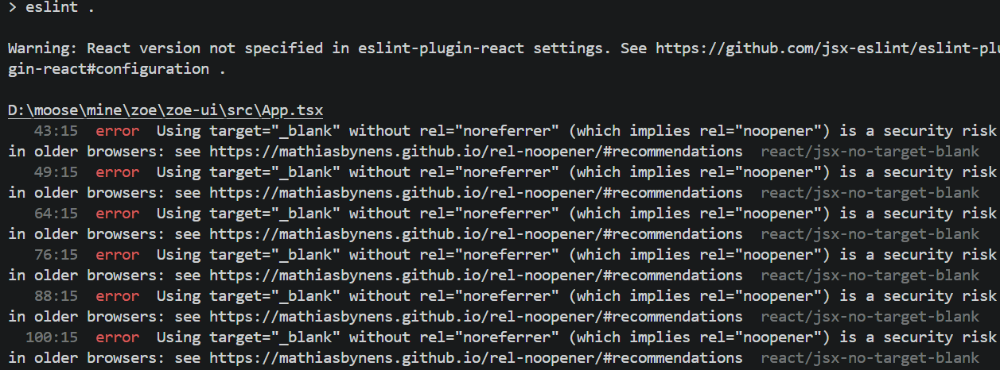

因为初始化项目当中存在很多img，使用了 `target="\_blank"` 的链接没有添加 `rel="noreferrer"` 属性。

这是一个安全漏洞。当你在 `<a>` 标签中使用 `target="\_blank"` 时，新页面可以通过 window.opener 访问原始页面的 window 对象，可能导致：

- 钓鱼攻击：新页面可以重定向原页面到恶意网站
- 信息泄露：新页面可以读取原页面的部分信息
- 性能问题：新页面和原页面共享同一个进程

解决办法：找到项目中所有使用 target="\_blank" 的地方，添加 rel="noreferrer" 或 rel="noopener noreferrer"。ESLint 的 --fix 选项可能无法自动修复这个问题，需要手动添加 rel 属性。

【问题2】：

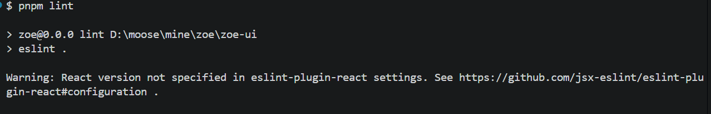

这个问题出现在：ESLint 配置中没有指定 React 版本。

eslint-plugin-react 需要知道你的 React 版本，因为：

- 不同版本的 React 有不同的特性和 API
- 某些规则的行为依赖于 React 版本
- 自动修复功能需要知道 React 版本

解决办法：在 ESLint 配置中添加 settings

```javascript
{
    files: ["**/*.{ts,tsx}"],
    extends: [
        // ...
    ],
    languageOptions: {
        // ...
    },
    settings: {
        react: {
        version: "detect", // 自动检测 React 版本
        },
    },
    rules: {
        // ...
    },
},
```

#### Git Hooks配置（Husky + lint-staged）

> 提交阶段进行代码规范化校验，以及格式处理，确保当前需要提交的代码的格式规范

```bash
pnpm add -D husky lint-staged
```

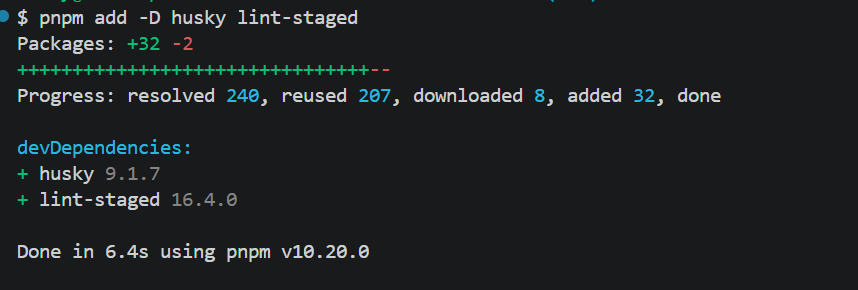

初始化Husky

```bash
pnpm pkg set scripts.prepare="husky"
pnpm prepare
```

完成之后，项目根目录下会显示如下内容信息：

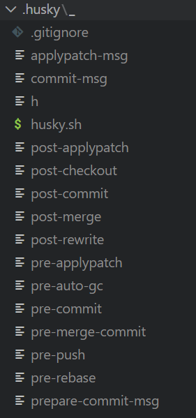

创建 pre-commit hook

```bash
cat > .husky/pre-commit << EOF
#!/usr/bin/env sh
. "\$(dirname -- "\$0")/_/husky.sh"

pnpm lint-staged
EOF

chmod +x .husky/pre-commit  # Windows 不需要这条
```

也可以直接使用官方命令：

```
pnpm exec husky init
```

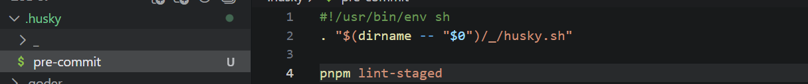

在`package.json`中添加：

```json
{
  "lint-staged": {
    "*.{ts,tsx,js,jsx}": ["eslint --fix", "prettier --write"],
    "*.{json,md,css,scss}": ["prettier --write"]
  }
}
```

#### commitlint配置

> 提交描述规范，在一定程度上要求开发人员每次都清晰地知道自己提交了哪些内容，以及明确提交代码的类型（问题修复、优化、 新功能开发等）

安装

```bash
pnpm add -D @commitlint/cli @commitlint/config-conventional
```

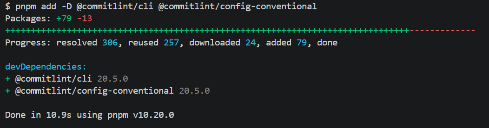

创建配置文件，在项目根目录创建 commitlint.config.js

```javascript
export default {
  extends: ["@commitlint/config-conventional"],
  rules: {
    "type-enum": [
      2,
      "always",
      [
        "feat", // 新功能
        "fix", // 修复
        "docs", // 文档
        "style", // 格式
        "refactor", // 重构
        "perf", // 性能
        "test", // 测试
        "chore", // 构建/工具
        "ci", // CI 配置
        "revert", // 回退
      ],
    ],
    "type-case": [2, "always", "lower-case"],
    "type-empty": [2, "never"],
    "subject-empty": [2, "never"],
    "subject-case": [0], // 不限制主题大小写
    "header-max-length": [2, "always", 100],
  },
};
```

集成到 Husky，创建 .husky/commit-msg 文，添加配置：

```
#!/usr/bin/env sh
. "$(dirname -- "$0")/_/husky.sh"

npx --no -- commitlint --edit
```

Commitlint 规范示例:

```
// 正确格式：
feat: 添加 CSV 转 JSON 功能
fix: 修复大文件上传时内存泄漏问题
docs: 更新 README 安装说明
chore: 升级 Vite 到 8.0

feat(converter): 支持批量文件转换
fix(ui): 修复移动端布局错乱

// 错误格式：

添加了一些功能
修复了一些bug
fix bug
update

```

最终我们希望达到的效果如下：

1. 执行`pnpm lint`没有异常

   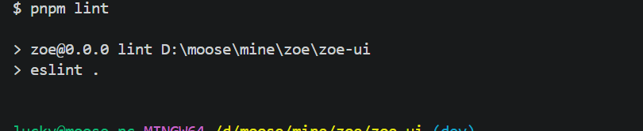

2. 执行`pnpm format`没有异常

   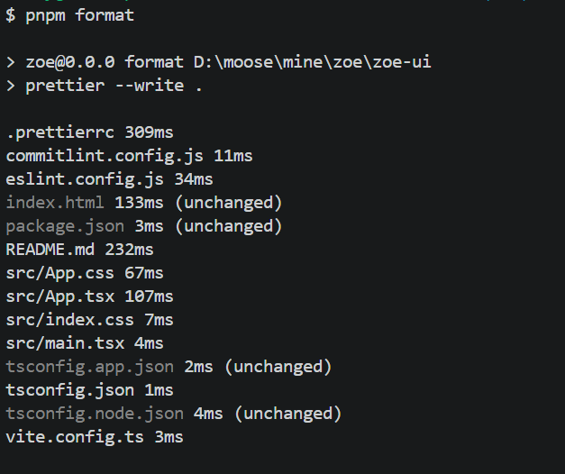

3. 错误的commit content提示异常，正确的正常提交：

   不规范的提交描述：

   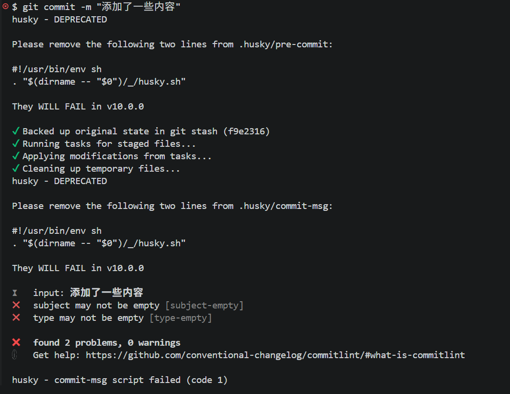

   符合规范的提交描述：

   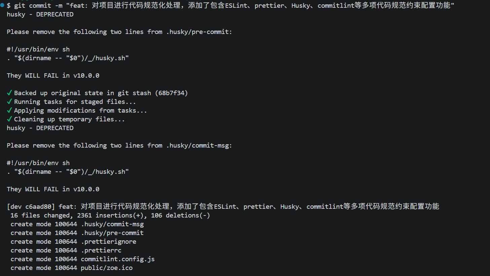

### Tailwind CSS配置

#### 安装

```bash
pnpm add -D tailwindcss autoprefixer
pnpm add -D @tailwindcss/vite
```

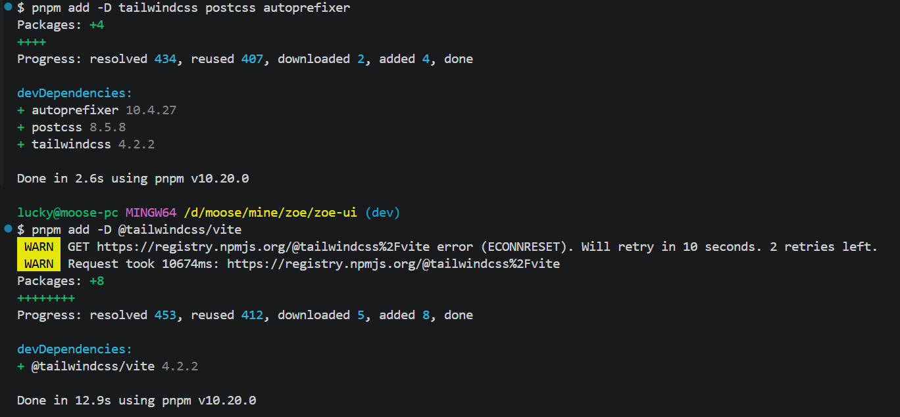

> 特别注意：v4版本已经不再需要PostCSS，不再使用@tailwind指令（v3语法）
> Tailwind v4 通过 CSS 变量自定义主题，在 @import 后添加：

```css
@import "tailwindcss";

@theme inline {
  --color-primary: #aa3bff;
  --color-secondary: #6b6375;
  /* 其他自定义变量 */
}
```

Tailwind v4 使用新的 @import 语法，在 src/index.css 最顶部添加：

```css
@import "tailwindcss";

/* 原有的样式保留在下面 */
:root {
  /* ... */
}
```

### shadcn/ui配置

用习惯了ElementUI/antDesign这种深度封装的UI组件库的开发者一定要理解shadcn和这些UI组件库的本质区别，shadcn提供的是完整的组件代码，用官方的话就是：不是一个组件库，而是一套“可复制粘贴的组件集合”，通过 CLI（如 `npx shadcn@latest add button`）把源代码直接复制到你的项目目录（通常是 components/ui/）。组件完全属于你，你可以随意修改、扩展，甚至重写。

举个栗子就是：

- Element Plus / Antd = “买现成家具，风格统一但改起来麻烦”。
- shadcn = “给你一套高质量家具图纸 + 材料，你自己动手组装和改造成自己家的风格”

#### 安装shadcn/ui cli

```bash
pnpm add -D shadcn@latest
```

#### 初始化shadcn/ui

```bash
pnpm dlx shadcn@latest init
```

初始化的时候可能会出现如下异常提示：

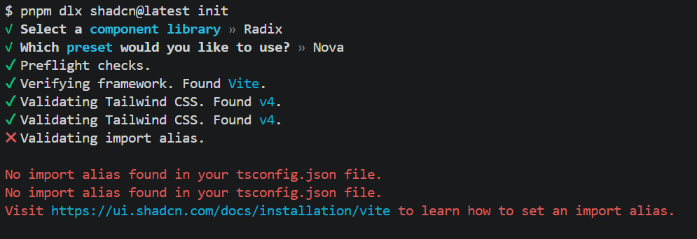

产生原因：shadcn/ui 需要 TypeScript 配置中的路径别名（import alias），但你的 tsconfig.json 中可能没有配置。问题根源是shadcn/ui 需要使用路径别名来导入组件，例如：

```typescript
import { Button } from "@/components/ui/button";
```

解决办法：在tsconfig.json中添加路径别名配置

```json
{
  "files": [],
  "references": [
    { "path": "./tsconfig.app.json" },
    { "path": "./tsconfig.node.json" }
  ],
  "compilerOptions": {
    "baseUrl": ".",
    "paths": {
      "@/*": ["./src/*"]
    }
  }
}
```

同时在 tsconfig.app.json 中也需要添加相同的配置：

```json
{
  "compilerOptions": {
    // ... 其他配置
    "baseUrl": ".",
    "paths": {
      "@/*": ["./src/*"]
    }
  },
  "include": ["src"]
}
```

修改 vite.config.ts（添加 Vite 的 resolve.alias 配置）：

```typescript
import { defineConfig } from "vite";
import react from "@vitejs/plugin-react";
import tailwindcss from "@tailwindcss/vite";
import path from "path";

export default defineConfig({
  plugins: [react(), tailwindcss()],
  resolve: {
    alias: {
      "@": path.resolve(__dirname, "./src"),
    },
  },
});
```

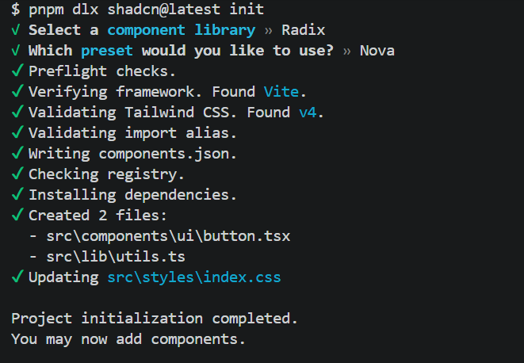

到这一步你会发现，在src中会多出components/ui目录、lib/utils.ts文件，存放的就是shadcn/ui源码。关于使用shadcn/ui还是有些比较推荐的使用方法的：

1. 用到哪个组件就添加哪个组件，而且这个组件是无样式的，要什么样式，自己通过tailwindCSS的className直接添加，但是不建议直接改原始组件，推荐目录如下：

```
npx shadcn@latest add button card dialog
```

```
src/
├── components/
│   ├── ui/                  ← 原始从 shadcn 复制来的基础组件（尽量少直接修改）
│   │   ├── button.tsx
│   │   ├── dialog.tsx
│   │   └── table.tsx
│   ├── ui-custom/           ← 你轻度封装/扩展的基础组件（推荐层）
│   │   ├── button.tsx       ← 这里包裹 shadcn 的 button
│   │   └── card.tsx
│   ├── form/                ← 业务表单组件（组合 Form + Input + Button 等）
│   ├── layout/              ← Navbar、Sidebar 等
│   ├── blocks/              ← 页面级组合块（如 DashboardCard、PricingTable）
│   └── index.ts             ← 统一导出常用组件
├── lib/
│   └── utils.ts             ← shadcn 自带的 cn() 函数
├── styles/
│   └── globals.css          ← 定义设计 tokens（CSS variables）
```

> 尽量保留shadcn的原始组件，通过ui-custom做轻量化封装，业务组件组合封装

2. 使用对比， 以Button为例

ElementPlus：

```html
<el-button type="primary" size="large" plain round>保存</el-button>
<!-- 想彻底改成品牌风格？去改 theme 或加一些 class，vue组件内部可以使用 :deep(.el-button){...} 修改 -->
```

shadcn/ui:

```tsx
import * as React from "react";
import { cva, type VariantProps } from "class-variance-authority";
import { Slot } from "radix-ui";

import { cn } from "@/lib/utils";

const buttonVariants = cva(
  "group/button inline-flex shrink-0 items-center justify-center rounded-lg border border-transparent bg-clip-padding text-sm font-medium whitespace-nowrap transition-all outline-none select-none focus-visible:border-ring focus-visible:ring-3 focus-visible:ring-ring/50 active:translate-y-px disabled:pointer-events-none disabled:opacity-50 aria-invalid:border-destructive aria-invalid:ring-3 aria-invalid:ring-destructive/20 dark:aria-invalid:border-destructive/50 dark:aria-invalid:ring-destructive/40 [&_svg]:pointer-events-none [&_svg]:shrink-0 [&_svg:not([class*='size-'])]:size-4",
  {
    variants: {
      variant: {
        default: "bg-primary text-primary-foreground [a]:hover:bg-primary/80",
        outline:
          "border-border bg-background hover:bg-muted hover:text-foreground aria-expanded:bg-muted aria-expanded:text-foreground dark:border-input dark:bg-input/30 dark:hover:bg-input/50",
        secondary:
          "bg-secondary text-secondary-foreground hover:bg-secondary/80 aria-expanded:bg-secondary aria-expanded:text-secondary-foreground",
        ghost:
          "hover:bg-muted hover:text-foreground aria-expanded:bg-muted aria-expanded:text-foreground dark:hover:bg-muted/50",
        destructive:
          "bg-destructive/10 text-destructive hover:bg-destructive/20 focus-visible:border-destructive/40 focus-visible:ring-destructive/20 dark:bg-destructive/20 dark:hover:bg-destructive/30 dark:focus-visible:ring-destructive/40",
        link: "text-primary underline-offset-4 hover:underline",
      },
      size: {
        default:
          "h-8 gap-1.5 px-2.5 has-data-[icon=inline-end]:pr-2 has-data-[icon=inline-start]:pl-2",
        xs: "h-6 gap-1 rounded-[min(var(--radius-md),10px)] px-2 text-xs in-data-[slot=button-group]:rounded-lg has-data-[icon=inline-end]:pr-1.5 has-data-[icon=inline-start]:pl-1.5 [&_svg:not([class*='size-'])]:size-3",
        sm: "h-7 gap-1 rounded-[min(var(--radius-md),12px)] px-2.5 text-[0.8rem] in-data-[slot=button-group]:rounded-lg has-data-[icon=inline-end]:pr-1.5 has-data-[icon=inline-start]:pl-1.5 [&_svg:not([class*='size-'])]:size-3.5",
        lg: "h-9 gap-1.5 px-2.5 has-data-[icon=inline-end]:pr-3 has-data-[icon=inline-start]:pl-3",
        icon: "size-8",
        "icon-xs":
          "size-6 rounded-[min(var(--radius-md),10px)] in-data-[slot=button-group]:rounded-lg [&_svg:not([class*='size-'])]:size-3",
        "icon-sm":
          "size-7 rounded-[min(var(--radius-md),12px)] in-data-[slot=button-group]:rounded-lg",
        "icon-lg": "size-9",
      },
    },
    defaultVariants: {
      variant: "default",
      size: "default",
    },
  },
);

function Button({
  className,
  variant = "default",
  size = "default",
  asChild = false,
  ...props
}: React.ComponentProps<"button"> &
  VariantProps<typeof buttonVariants> & {
    asChild?: boolean;
  }) {
  const Comp = asChild ? Slot.Root : "button";

  return (
    <Comp
      data-slot="button"
      data-variant={variant}
      data-size={size}
      className={cn(buttonVariants({ variant, size, className }))}
      {...props}
    />
  );
}

export { Button, buttonVariants };
```

源组件引用，我们看看效果：


在ui-custom当中简单封装这个组件, 封装outline和primary两种类型的button，我们试试看：


